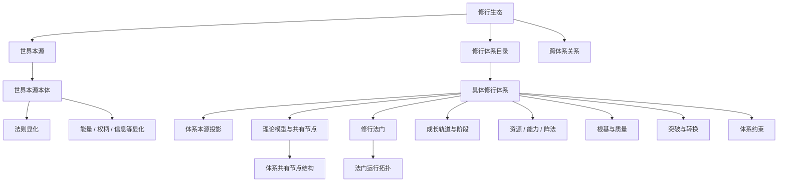

# 修行生态设计方案

> 状态：目标设计
>
> 版本：V6
>
> 适用范围：MyAgents 小说工作台的修行生态领域模型、目录化存储、编辑界面与审查规则。

## 1. 目标与边界

本方案将原“力量体系”统一调整为“修行体系”，以“修行生态”作为项目级总称。

这里的“修行”指角色获得、控制、成长或转化超常能力的完整路径。它覆盖内丹、武道、魔法、异能、血脉、神权、仪式与科技改造等类型；道家内丹是完整而强大的体系预设，不是所有体系的底层模型。

### 1.1 核心原则

1. 全局层只保存世界本源、修行体系目录与跨体系关系。
2. 本源投影、理论共有结构、成长阶段、资源、法门、法门运行拓扑、能力、阵法、根基、突破和约束必须归属于某个具体修行体系；法门运行拓扑进一步归属于具体法门。
3. 资源、修行法门、能力与阵法定义一次，通过关联记录服务阶段、突破和部署，禁止复制资产实体。
4. 数值指标、成长轨道、术语、资源类型、执行方式均由体系自行定义，不能硬编码灵力、经络、法力或经验值。
5. 跨体系使用、转换、压制或污染必须由显式跨体系关系或本源投影说明，不允许隐式引用。

### 1.2 非目标

- 不建立一套独立于小说项目目录的修行生态存储后端。
- 不把阵法、功法、经络或魔法规则写死为某一种题材的唯一形式。
- 不在全局层建立“体系架构”“全局境界”或“全局资源库”。
- 不把泛化关系字段作为解锁、资源消耗、突破、上限等核心业务规则的唯一承载。

## 2. 总体结构



### 2.1 全局层与体系层的归属

| 对象         | 所属范围               | 负责回答的问题                         | 不负责的内容                       |
| ------------ | ---------------------- | -------------------------------------- | ---------------------------------- |
| 世界本源本体 | 项目全局               | 世界由什么构成，以及本源如何展开。     | 某体系如何运行、修炼或施法。       |
| 法则显化     | 项目全局，隶属世界本源 | 什么可以发生、如何转化、边界在哪里。   | 某角色可用的具体能力。             |
| 载体显化     | 项目全局，隶属世界本源 | 哪些可调用的能量、权柄或信息可被接入。 | 每个体系的资源库。                 |
| 修行体系     | 项目全局目录           | 一套独立的成长、运行和资产模型是什么。 | 其它体系的内部实体。               |
| 跨体系关系   | 项目全局               | 两个体系是否兼容、冲突、转换或依赖。   | 代替体系内的法门、能力或资源定义。 |
| 体系内部模块 | 单个修行体系           | 该体系如何修行、成长、部署和付出代价。 | 被其它体系直接修改。               |

## 3. 世界本源

### 3.1 世界本源本体

世界本源本体是存在论结构，例如大道、混沌、创世者、世界魔网、源代码、虚无或诸神体系。它不等同于法则，也不等同于能量。

每个世界本源本体定义名称、摘要、本体陈述、作用域与约束，并通过多类显化节点展开：

| 显化类型 | 作用                                     | 示例                                           |
| -------- | ---------------------------------------- | ---------------------------------------------- |
| 法则显化 | 规定成立条件、转化规律、限制和代价。     | 阴阳五行、等价交换、元素克制、权限边界、因果。 |
| 载体显化 | 提供可积累、消耗、授权或传递的操作对象。 | 灵气、魔力、神恩、情绪、星辉、算力、权限。     |

载体显化是可选的。概念、神权、社会授权或纯信息体系可以没有传统意义的能量。

### 3.2 体系本源投影

本源投影属于修行体系，描述该体系从世界本源中接入了什么、如何解释与使用。

每个投影包含：

- 一个或多个世界本源引用，记录主源、次源、用途和权重。
- 采用的法则显化与载体显化。
- 接入方式：先天、修炼、血脉、契约、仪式、设备、社会授权等。
- 本地化翻译：该体系如何把世界规则解释成可操作模型。
- 衰减和边界：地域、时代、认知、权限、设备、环境或世界状态限制。
- 体系特有副作用：污染、异化、失控、神性同化、数据反噬等。

不同体系可以投影自同一世界本源，但拥有不同理论共有结构、法门运行拓扑、阶段和资产模型，从而表达“同源异流”。

## 4. 修行体系的正式结构

```text
修行体系
├─ 基本信息与术语表
├─ 体系本源投影
├─ 理论模型
├─ 成长轨道与阶段
├─ 资源库
├─ 修行法门库
├─ 能力库
├─ 阵法与部署
├─ 根基与质量
├─ 突破与转换
├─ 体系约束
└─ 审查
```

| 模块           | 职责                                                               | 关键关联                                 |
| -------------- | ------------------------------------------------------------------ | ---------------------------------------- |
| 体系本源投影   | 定义力量从哪里来、如何接入及其边界。                               | 世界本源、显化节点。                     |
| 理论模型       | 解释为什么能够修行、施法或改造，并定义体系共有的节点结构与不变量。 | 法则、共有节点、法门、阵法。             |
| 成长轨道与阶段 | 定义成长状态、指标、门槛、质量和阶段关系。                         | 资源、法门、能力、突破。                 |
| 资源库         | 统一定义可消耗物、环境、材料、知识、权限等。                       | 阶段需求、法门课程、突破、阵法。         |
| 修行法门库     | 定义多部成长方案、运行指令、专属执行拓扑、课程和上限。             | 理论节点、阶段、资源、能力。             |
| 能力库         | 定义技能/法术/神通/异能术的获得方式、功能类型、效果和运行成本。    | 阶段、法门、契约、装备、资源、能量指标。 |
| 阵法与部署     | 定义可布设、激活、维持与反制的复合应用。                           | 理论节点、法门路线、阶段、资源、能力。   |
| 根基与质量     | 定义跨阶段影响成长速度、质量和上限的因素。                         | 轨道、阶段、法门、突破。                 |
| 突破与转换     | 定义阶段跃迁、转轨和失败语义。                                     | 阶段、资源、法门、质量、约束。           |
| 体系约束       | 定义代价、污染、反噬和不可逆后果。                                 | 全体系资产与行为。                       |

## 5. 理论模型与体系共有结构

### 5.1 理论模型

理论模型回答“为什么可以修行或施法”，并定义一套体系所有法门共享的结构基础。它定义表达体系、因果原理、执行模型、控制要求、节点库和结构不变量；它不规定某一部法门的灵气运行顺序。

示例：

- 内丹：精、气、神的转化与经络循环。
- 魔法：元素共鸣、符文语法和等价交换。
- 异能：精神负荷、基因表达与情绪触发。
- 科技：能源管理、控制协议与设备校准。

理论模型必须承担“共有节点结构”。例如修仙体系可以定义人体三百六十五个经脉节点、十二正经、奇经八脉、丹田和关窍，以及节点的容纳量、转化类型、通达条件和风险。法门只能引用这些节点，不能在运行时凭空创建匿名经脉。

### 5.2 体系共有节点结构

体系共有节点结构是经络、魔网、神经网络、设备管线和仪式接口的统一抽象。它只描述“有哪些节点、节点能做什么、节点之间允许怎样连接”，不描述某一部法门的具体路线。

| 节点类别 | 示例                                       |
| -------- | ------------------------------------------ |
| 生理节点 | 经络、窍穴、丹田、骨骼、血脉。             |
| 灵性节点 | 识海、魂宫、命格、灵魂锚点。               |
| 奥术节点 | 法力池、元素核心、符文节点、魔网接口。     |
| 异能节点 | 神经簇、情绪锚点、基因片段、精神屏障。     |
| 工程节点 | 芯片、反应炉、能源接口、权限服务。         |
| 外部节点 | 神祇、契约对象、仪式场地、阵基、网络终端。 |

每个节点至少定义 ID、名称、类别、结构位置、容纳 / 转换能力、前置通达条件、风险和可被哪些法门类型引用。理论节点库可以有数百个节点，界面默认展示结构摘要与代表节点，并支持按类别、部位和法门引用反查。

## 6. 成长轨道、阶段、根基与质量

### 6.1 成长轨道与数值指标

一个体系可定义一条或多条成长轨道，例如修为、炼体、神魂、法力、精神、元素亲和、觉醒率、改造程度或权限等级。

每项数值指标由体系定义名称、单位、模型和方向。模型支持固定数值、区间、公式或描述性判定。不得硬编码灵力、法力、经验值等指标。

### 6.2 阶段

每个阶段包含：

- 顺序、名称、阶段类型和可选子层级。
- 指标门槛、成长曲线、进入条件和维持条件。
- 突破条件、风险、失败模式、退化与认知/身体/灵性要求。
- 阶段质量和边界值。
- 资源、法门、能力关联记录。

阶段只持有引用和规则，不复制资源、法门与能力的完整定义。

### 6.3 根基与质量

根基是跨阶段因素，包括根骨、血脉、灵魂资质、元素亲和、改造程度、神眷、设备兼容度等。

根基因素定义基础值、影响方向、适用轨道、影响对象和修正方式。它们可影响成长速度、资源转化率、突破成功率、阶段质量、能力上限与法门兼容性。

质量模型定义同一阶段内部的品质差异，例如下品、上品、完美，或普通、稳定、超载、失控。质量维度由体系自行命名。

### 6.4 同体系多轨道交叉规则

当一个修行体系定义了多条成长轨道时，可选择定义轨道之间的交叉规则。交叉规则只作用于同一体系内部；跨体系交互属于§12 的跨体系关系。

**同步约束**：一条轨道的阶段进入或维持，要求另一条轨道达到最低阈值。例如"神魂轨道不能超过修为轨道两个大境界"。同步约束定义约束方轨道、被约束轨道、触发条件与违约后果（阻断突破、强制退化或连带惩罚）。

**协同效应**：两条或多条轨道同时达到特定配置时触发额外加成。例如"修为与炼体均达到化神期时，双轨溢出效率提升"。协同效应定义涉及轨道、触发条件、效果描述与持续方式（常驻或一次性）。

**失衡惩罚**：轨道之间的差距超过允许上限时产生连续性负面结果，例如走火入魔风险上升、资源转化率下降、能力发挥受限。惩罚定义差距计算方式、触发阈值、惩罚内容、严重度分级与解除条件。

**跨轨道突破条件**：某些突破节点需要多条轨道同时满足才能触发。这类突破在§11.1 的突破对象中定义，并在各轨道阶段中以"联合突破条件"标注。单条轨道单独达标不能触发此类突破。

**资源竞争与分配**：若多条轨道消耗同一资源，需定义优先级规则、分配比率或排斥逻辑，避免高强度修炼场景中产生资源歧义。

每条交叉规则定义涉及轨道列表、触发条件、效果、持续时间、例外情形、解除方式与叙事提示。审查器检查同步约束是否形成循环依赖（A要求B且B要求A），此类循环为结构性错误。

## 7. 资源库与阶段关联

资源是体系内资产，可以是能量、材料、药剂、环境、知识、情绪、仪式地点、信仰、设备、权限或算力。

每项资源定义：

- 类别、品质/浓度/纯度等级、供给方式和环境要求。
- 最低、最佳与最高适用阶段。
- 理论、法门、血脉、属性或设备限制。
- 可替代资源、替代损耗和短缺后果。
- 资源本体效果与副作用。

阶段通过 `LevelResourceRequirement` 关联资源，并记录主资源、辅助、催化、环境、稳定剂、可选替代、数量、品质、消耗方式、供给周期与短缺后果。

资源本体回答“这是什么、能在哪些阶段使用”；阶段关联回答“当前阶段实际需要它做什么”。

## 8. 修行法门

“修行法门”是统一领域名称。体系术语可将其显示为功法、冥想法、法术模型、觉醒训练、契约仪式或改造协议。

一个修行体系可以拥有多部法门。法门是体系内独立的成长方案，不是体系的单例属性。阶段可以关联多部法门，法门也可以覆盖多个阶段；“主修法门”只是当前角色或当前视图的选择，不改变法门库的多对象结构。

```text
修行法门
├─ 基本定位：类别、理论依据、适用轨道
├─ 覆盖范围：起始、稳定、理论、绝对上限
├─ 运行指令
├─ 执行路线
├─ 阶段课程
├─ 成长效果
├─ 兼容条件
└─ 风险与禁忌
```

### 8.1 三类上限

| 上限         | 含义                                         |
| ------------ | -------------------------------------------- |
| 稳定适用上限 | 正常修行下可靠覆盖的最高阶段。               |
| 理论上限     | 在资质、资源和环境理想时可以达到的最高阶段。 |
| 绝对上限     | 无论条件如何都无法突破的结构性极限。         |

### 8.2 运行指令

运行指令是“法诀”的通用抽象，可包含意向、符号、身体、操作和禁忌五类内容。

| 指令类型 | 内丹体系             | 魔法、异能与科技体系           |
| -------- | -------------------- | ------------------------------ |
| 意向     | 守一、存思、观想。   | 精神聚焦、目标锁定。           |
| 符号     | 法诀、真名、印诀。   | 咒文、符文、程序、密钥。       |
| 身体     | 吐纳、导引、结印。   | 姿态、感官训练、生物反馈。     |
| 操作     | 行功、收功、封藏。   | 施法顺序、校准、启动与停机。   |
| 禁忌     | 气机冲突、心神不稳。 | 元素冲突、负荷过载、权限不足。 |

内丹体系可将运行指令细化为总诀、行功诀、收功诀、禁忌诀与境界变诀。

### 8.3 法门运行拓扑

运行拓扑属于法门，而不是体系的独立资产。每部法门可有零条、一条或多条法门运行拓扑；每条拓扑引用当前体系理论模型中的真实节点与允许连接，并定义该法门自己的方向、顺序、停驻、分支、汇合、循环、转化、损耗、触发条件与失败后果。

同一体系的不同法门可以复用同一批经脉节点，但必须允许路线不同。例如“太虚周天功”可以走下丹田 → 会阴关 → 泥丸宫 → 命门 → 下丹田的小周天闭环；“太上感应篇”可以走紫府 → 识海 → 心火 → 归元的神魂观想路线；“五行炼体诀”则可以走骨门 → 血海 → 命门 → 周身的外内合炼路线。三者都属于同一套理论经脉结构，但不是同一张运行图。

法门运行拓扑对象至少包含：拓扑 ID、所属法门 ID、引用节点 ID、边与方向、节点停驻时间、分支 / 汇合规则、输入与输出介质、转换损耗、循环收束方式、适用阶段、法诀步骤、资源要求、失败后果和版本。

支持的路线结构：闭环、定向链、分支树、网络、外部仪式、状态机和混合结构。

- 内丹体系显示为经络周天路线，可表达起炉、引气、过关、归元、封藏、小周天、大周天、逆行与岔路。
- 魔法体系显示为魔力回路、符文图或施法序列。
- 异能体系显示为神经、精神或基因激活路径。
- 科技体系显示为能源与控制路径。

### 8.4 阶段课程

法门可为每个阶段定义课程：适用的运行指令版本、法门运行拓扑版本、资源配方、环境、步骤、时长、达标判定、掌握度、质量影响、成功结果和失败结果。

法门课程的资源属于“该法门特有的训练成本”；阶段资源属于“达到或维持该阶段的客观需求”。二者必须分开建模。

## 9. 能力库

技能是能力库中的可执行能力。体系可以按本地术语将技能显示为法术、神通、技能、异能术、武技、仪式或工程操作。技能有两个互相独立的分类维度：获得方式与功能类型。

### 9.1 技能获得方式

| 获得方式      | 规则                                                                                         | 典型字段                                                                         |
| ------------- | -------------------------------------------------------------------------------------------- | -------------------------------------------------------------------------------- |
| 境界自动解锁  | 达到指定阶段、完成转换或满足血脉/根基条件后自然获得，不要求学习秘籍。                        | `unlockLevelId`、`unlockCondition`、`naturalAbility`                             |
| 秘籍/法门修炼 | 必须持有或理解相关秘籍，并按指定法门课程、运行指令和路线训练；可以早于完整发挥阶段开放学习。 | `trainingMethodIds`、`manualId`、`masteryStages`、`trainingResourceRequirements` |

第二类技能仍然可以要求资源才能修炼。修炼资源记录资源 ID、角色（主资源、催化、稳定剂、环境或可选替代）、数量、品质、消耗周期、替代损耗与短缺后果；它与技能释放时的能量消耗分开建模。

### 9.2 技能功能类型

功能类型与获得方式正交，同一类技能可以自动解锁，也可以通过秘籍修炼。

| 功能类型 | 作用                                                                 | 典型字段                                                              |
| -------- | -------------------------------------------------------------------- | --------------------------------------------------------------------- |
| 辅助类   | 感知、移动、治疗、护盾、增益、控制、生产或环境改变。                 | `functionType`、`effectProfile`、`supportTargets`                     |
| 精神类   | 作用于意识、记忆、情绪、灵魂、认知或精神连接。                       | `mentalTargets`、`cognitiveRisk`、`resistanceModel`                   |
| 进攻类   | 将体系能量组织成攻击输出。其本质是能量放大器，不应只记录“伤害数值”。 | `amplificationModel`、`inputEnergy`、`outputEnergy`、`conversionLoss` |

进攻类技能至少定义：输入能量类型与数量、放大倍率或放大公式、输出形态、转换损耗、峰值、持续时间、过载阈值、反制方式和失败后果。放大器可以提高能量的强度、密度、速度、穿透、范围或作用层级，但不能绕过体系约束凭空创造能量。

### 9.3 技能运行模型

技能定义还必须区分“修炼成本”和“释放成本”：

- `trainingResourceRequirements`：掌握技能所需的资源、课程和训练周期，只在修炼/提升掌握度时消耗。
- `castCost`：每次激活或维持技能时消耗的体系能量、权柄、精神负荷、情绪或设备额度。
- `castCostModel`：固定、按时间、按范围、按目标数量、按输出功率或自定义公式。
- `reserveRequirement`：施放前最低储备、最低稳定度或最低权限。
- `sustainCost`：持续技能的每周期消耗，以及中断、欠费和强制停机结果。

每项能力定义目标、范围、持续时间、激活、效果、限制、副作用、反制、掌握等级和完整发挥上限。技能可以拥有多个消耗项，例如“真元 + 神魂稳定度”或“魔力 + 符文媒介”；不同消耗项的短缺后果必须分别描述。

阶段通过 `LevelAbilityAccess` 描述能力的自然获得、开放学习、禁用条件和完整发挥阶段；技能通过 `AbilityTrainingRequirement` 描述秘籍、法门课程与修炼资源。能力开放学习的阶段可以早于能力完全发挥的阶段。契约、血脉和设备等接入方式属于体系绑定或根基条件，不新增第三类能力获得方式。

建议的统一结构：

```text
Ability / Skill
├─ 获得方式：境界自动解锁 | 秘籍/法门修炼
├─ 功能类型：辅助 | 精神 | 进攻
├─ 解锁与掌握阶段
├─ 关联法门与秘籍
├─ 修炼资源与训练成本
├─ 释放能量与维持成本
├─ 效果、范围、持续时间、反制
└─ 进攻类专属：能量输入、放大模型、损耗、过载和输出上限
```

## 10. 阵法与部署

阵法是体系内部的复合应用资产，模块统一命名为“阵法与部署”。

| 体系类型   | 用户界面名称         |
| ---------- | -------------------- |
| 内丹、修真 | 阵法、阵图、禁制。   |
| 魔法       | 仪式网络、法术矩阵。 |
| 异能       | 共鸣场、精神网络。   |
| 科技       | 工程阵列、控制网络。 |

每个阵法与部署对象包含：

- 类型、结构、规模、用途和输出。
- 关联理论共有节点、所需阶段、法门、能力和资源；如阵法复用某部法门的路线，必须显式引用该法门运行拓扑版本。
- 阵元/节点、阵内流向、激活、维持、停机与拆解。
- 覆盖边界、供给模型、风险、反制与失效模式。

阵法只能引用当前体系的资产。阵法中的节点和流向属于部署自身；理论共有节点属于体系结构，法门运行拓扑属于具体法门，阵法可以引用二者但不能把部署流向写回法门路线。

## 11. 突破、转换与体系约束

### 11.1 突破与转换

突破与转换是一等对象，不是阶段状态箭头的附注。它定义起止阶段、转换类型、所需法门、条件、资源、质量继承、成功规则、成功结果、失败结果、退化状态、永久伤害与可逆性。

它支持同轨道突破、跨轨道转化、体系内部改修、外部契约授予、设备改造和不可逆异化。

### 11.2 体系约束

体系约束也是一等对象。每条约束定义触发条件、作用对象、代价、后果、解除方式、叙事提示和不可逆性。

常见类型：资源守恒、污染、反噬、认知偏差、契约违约、设备过热、权限冻结、肉体损伤、灵魂异化和世界规则压制。

## 12. 跨体系关系

跨体系关系位于项目全局层，但只连接两个修行体系。每条关系必须定义方向、类型、适用条件、可作用资产、转换规则或比率、结果、风险、失败语义与边界。

| 关系类型  | 示例                           |
| --------- | ------------------------------ |
| 兼容/共存 | 武道体魄提升可承载魔力。       |
| 冲突/压制 | 圣光净化亡灵体系。             |
| 转换      | 火元素魔力可转化为火行灵气。   |
| 依赖      | 神术依赖神祇授权。             |
| 继承      | 血脉体系可为异能觉醒提供基础。 |
| 污染      | 深渊力量侵蚀修真根基。         |

跨体系关系不创建跨体系资产所有权。若体系 A 使用体系 B 的资源、能力或法门，必须通过该关系定义转换、授权或副作用，然后在体系 A 中形成自己的本地化对象或受控引用。

## 13. 术语表与体系预设

每个修行体系拥有术语表。内部语义不变，显示名称可按题材替换。

| 内部语义     | 内丹       | 魔法     | 异能           | 科技     |
| ------------ | ---------- | -------- | -------------- | -------- |
| 修行体系     | 修行体系   | 魔法体系 | 异能体系       | 改造体系 |
| 成长阶段     | 境界       | 环阶     | 觉醒阶段       | 改造等级 |
| 修行法门     | 功法       | 法术模型 | 训练方案       | 操作协议 |
| 理论共有节点 | 经脉与关窍 | 魔网节点 | 神经与精神节点 | 能源接口 |
| 法门运行拓扑 | 功法周天   | 法术回路 | 异能激活路径   | 操作管线 |
| 阵法与部署   | 阵法       | 仪式网络 | 共鸣场         | 工程阵列 |

创建体系时可选择内丹/武道、奥术/元素、异能/精神、血脉/进化、神权/契约、科技改造、自定义或混合预设。预设只提供字段标签、默认指标、节点类型与编辑模板，不能限制用户添加新的模型。

## 14. 界面与交互

```text
修行生态
├─ 世界本源
│  ├─ 本源本体
│  ├─ 法则显化
│  └─ 载体显化
├─ 修行体系
│  ├─ 体系总览
│  ├─ 本源投影
│  ├─ 理论模型
│  ├─ 成长轨道与阶段
│  ├─ 资源库
│  ├─ 修行法门
│  ├─ 能力库
│  ├─ 阵法与部署
│  ├─ 根基与质量
│  ├─ 突破与转换
│  ├─ 体系约束
│  └─ 审查
├─ 跨体系关系
└─ 跨体系关系
```

### 14.1 核心页面

| 页面           | 主要操作                                                                                                                                     |
| -------------- | -------------------------------------------------------------------------------------------------------------------------------------------- |
| 世界本源       | 建立本源本体、分化节点、法则与载体显化，查看被哪些体系投影引用。                                                                             |
| 体系总览       | 查看体系完整度、成长轨道、资产数量、风险和审查结果。                                                                                         |
| 理论模型       | 编辑体系共有节点结构、不变量和可被法门引用的节点库；从节点反查哪些法门路线使用它。                                                           |
| 成长轨道与阶段 | 编辑指标、阶段、质量、阶段资产关联和转换关系。                                                                                               |
| 修行法门       | 在同一体系内管理多部法门，编辑总览、运行指令、法门运行拓扑、阶段课程、效果上限与风险。                                                       |
| 能力库         | 按两种获得方式和功能类型分组查看技能：境界自动获得、秘籍修炼获得；同时查看秘籍来源、法门课程、修炼资源、释放能量、维持消耗与进攻类放大模型。 |
| 阵法与部署     | 编辑阵元和阵内流向，配置激活、供给、边界和反制。                                                                                             |
| 审查           | 显示缺失字段、无效引用、冲突、断路和跨体系违规；显示体系完整度评分。                                                                         |
| 物品库关联     | 法门、秘籍来源和阵法通过稳定 `itemIds` 关联已有物品库；修行生态不复制物品实体、不管理角色持有状态。                                          |

### 14.2 体系完整度评分

体系完整度评分在体系总览和审查页显示，帮助作者判断体系是否可用于叙事引用或导出。

评分将体系必填字段分为四个权重层级：

| 层级               | 内容                                                                 | 说明                   |
| ------------------ | -------------------------------------------------------------------- | ---------------------- |
| 核心（缺失即错误） | 本源投影、至少一条成长轨道、至少一个阶段                             | 缺少则无法进行任何审查 |
| 结构（缺失为警告） | 理论模型与共有节点、资源库至少一项、突破定义、至少一部法门的运行拓扑 | 缺失会产生大量悬空引用 |
| 扩展（缺失为建议） | 阵法、根基因素、体系约束、法门阶段课程                               | 体系可用但不完整       |
| 叙事（可选）       | 术语表覆盖率、长篇理论说明、里程碑日志                               | 面向读者体验           |

完整度百分比 = （已填核心字段 × 4 + 已填结构字段 × 2 + 已填扩展字段 × 1）/ 满分。

| 评分区间 | 状态标签 | 含义                               |
| -------- | -------- | ---------------------------------- |
| < 40%    | 草稿     | 不可用于审查或导出                 |
| 40–70%   | 可用     | 可在叙事中引用，审查会产生大量警告 |
| 70–90%   | 完整     | 可发布，审查仅余建议项             |
| 90–100%  | 出版级   | 所有核心路径完整，审查零错误       |

修行法门编辑页使用以下标签：

```text
总览 ｜ 运行指令 ｜ 执行路线 ｜ 阶段课程 ｜ 效果与上限 ｜ 兼容与风险
```

法门编辑页内嵌运行拓扑画布：选中法门后，只高亮该法门引用的理论节点和专属流向，并显示步骤编号、方向、循环、分支、回流、收束点和风险点。切换法门时切换整张运行图；阵法画布独立显示阵元及阵内流向。

## 15. 审查规则

审查器至少检查以下事项：

1. 所有体系内引用是否属于当前体系。
2. 本源投影引用的显化节点是否确实属于选定世界本源。
3. 成长阶段的指标门槛、转换起止点和公式依赖是否完整。
4. 资源适用范围与阶段需求、法门课程是否冲突。
5. 法门的阶段课程、上限、执行路线和理论依据是否一致。
6. 需要闭环的执行路线是否闭合；非闭环路线是否定义起点、终点与收束方式。
7. 能力的获得方式、功能类型、关联法门/秘籍和完整发挥阶段是否一致。
8. 秘籍修炼技能是否定义训练资源，且训练资源是否误用为释放消耗。
9. 技能释放消耗是否引用当前体系定义的能量指标，并定义储备、维持和欠费结果。
10. 进攻类技能是否定义能量放大模型、转换损耗、过载阈值和反制方式。
11. 阵法的节点、流向、供给、激活、维持、输出和失效方式是否完整。
12. 根基、质量、突破和体系约束是否产生无法解释的冲突。
13. 跨体系调用是否存在明确关系、转换规则和副作用。

审查结果应按错误、警告、建议三级呈现，并给出受影响实体、关联路径和修复入口。

14. 秘籍来源、法门和阵法保存的 `itemIds` 是否符合稳定 ID 格式；若已加载物品库索引，则进一步检查物品是否存在。
15. 同体系多轨道交叉规则（§6.4）中的同步约束是否形成循环依赖（A 要求 B 达到门槛，B 又要求 A 达到门槛）；此类循环为结构性错误，必须以红色错误呈现。

## 16. 存储与实现约束

修行生态是小说项目的领域事实源，应由小说工作台自己的 Repository、Schema 与 JSON/Markdown codec 管理。文件读写必须经过绑定当前小说根目录的 `WorkbenchStorage`，使用 UTF-8、2 空格 JSON 缩进和原子写入。

修行生态以 `world/cultivation/index.json` 为事实源入口，由修行生态 Repository、Schema 与目录 codec 统一管理。根索引只保存生态版本、更新时间、本源目录、体系目录和跨体系关系入口；不得在根索引内嵌具体体系模块。

每个体系存入 `world/cultivation/systems/<system-id>/`。`system.json` 只保存体系基本信息、术语和模块路径；投影、理论、成长轨道、轨道交互、资源、法门、能力、阵法、根基、跃迁、约束与审查分别存储。自然形成大型集合的模块使用 `index.json + records/<entity-id>.json`；理论节点使用 `theory/index.json + theory/nodes/<node-id>.json`。世界本源和跨体系关系同样按索引与记录拆分。

Repository 对视图暴露聚合后的 `CultivationEcology`，视图不得拼接领域文件路径。保存时先校验完整聚合和跨模块引用，只写发生变化的模块文件，最后提交根索引；读取、AI 上下文和提案审阅均使用同一目录 codec。提案按受影响文件记录 before/after，不复制整个修行生态。

文件路径中的 `system-id` 与实体文件名必须等于实体稳定 ID，并且只能使用小写字母、数字和连字符。未被索引引用的文件不属于当前事实源。

工作台不得直接调用 Tauri 文件 API、宿主 Chat、Tab 或 Sidecar。大型 AI 设计任务通过既有 `agentSessions.open()` 打开完整会话；小型字段生成通过工作台受控运行接口返回候选内容，必须经用户确认后写入领域 Repository。

## 17. 版本边界

V6 只接受本节定义的目录化事实源，不读取 `world/cultivation-ecology.json`，也不提供旧版本兼容、自动补全或迁移流程。新项目直接初始化 `world/cultivation/`；已有测试项目需要修炼体系时，由作者在新版工作台中重新建立。

## 18. 验收标准

完成 V6 后，作者应能够：

1. 在项目层建立多个世界本源本体、分化节点、法则和载体显化。
2. 建立多个同源或异源的修行体系，并清楚表达它们的兼容、冲突和转换。
3. 为任意体系定义自有指标、轨道、阶段、质量、根基和突破机制。
4. 从一个阶段查看所需资源、可修法门和可获得能力；从资源、法门或能力反查覆盖阶段，并区分技能修炼资源与技能释放能量。
5. 为内丹功法编辑法诀和经络周天路线，同时为魔法、异能或科技体系编辑等价但不受道家术语限制的执行模型。
6. 用阵法与部署模块表达法阵、仪式网络、共鸣场或工程阵列。
7. 在保存前获得可行动的结构审查结果，并定位错误引用、断路、缺失条件和跨体系违规。
8. 在能力库中区分境界自动解锁与秘籍修炼获得两类能力，并为后者配置来源法门、物品库典籍 ID 和训练资源。
9. 为法门和阵法关联物品库中的功法、阵图或仪式图典 ID，不在修行生态中复制物品实体。
10. 在含多条成长轨道的体系中，定义轨道交叉的同步约束与协同效应，并在审查器中验证循环依赖。

## 19. 角色修行档案（职责边界）

角色修行档案不属于修行生态的数据模型，也不在本工作台中创建或维护。角色当前境界、法门掌握、能力习得、典籍研读和内部能量储量由角色库负责；修行生态只定义可被角色引用的体系资产及其规则。以下内容仅保留为跨模块职责说明，不能写入 `world/cultivation/` 的体系模块。

档案不存储体系资产的完整定义，只持有引用 ID 和角色专属的进度状态。

### 19.1 档案结构

```text
角色修行档案（内化进度层）
├─ 体系绑定列表
├─ 法门修炼进度
├─ 能力掌握
├─ 典籍研读进度
├─ 内部资源储量
├─ 根基因素当前值
├─ 活跃约束与惩罚
└─ 修行里程碑日志
```

物品的实体持有（资源物品、典籍物品、法门文献、器物）统一由§21物品栏管理。档案只记录内化了什么、达到了什么，不记录"包里装着什么"。

**体系绑定**记录角色与哪些修行体系产生了正式关联，包括绑定方式（生而有之、后天修炼、契约授予、血脉激活）、当前各轨道阶段 ID、各轨道当前指标值、绑定状态（活跃、休眠、污染中、被封印）。一个角色可以绑定多个体系；跨体系状态由§12 的跨体系关系约束，不在档案内部处理。

**法门修炼进度**记录角色正在修炼或已完成修炼的法门，包括法门 ID、覆盖阶段、掌握状态（初修、熟练、圆满、残缺、停滞）。物理法门文献在物品栏中；此处只记录修炼进度本身，即知识是否已内化。

**能力掌握**记录角色已解锁或已习得的技能，包括技能 ID、获得来源（境界自动解锁、秘籍修炼）、掌握等级、完整发挥阶段，以及当前是否可用（受退化、封印或约束影响时标注原因）。

**典籍研读进度**记录角色对典籍的研读状态（研读中、研读完毕），仅在开始研读后创建记录；物理持有典籍（持有未读）属于物品栏，不在档案中重复记录。研读完毕后，档案保留该条目以备叙事考证；典籍物品是否还在物品栏由物品栏管理。

**内部资源储量**是角色体内已内化的资源快照（灵气、魔力、元神等内部指标），记录当前量、上限、充能速率与异常状态。此处不是材料库存——实体材料（灵石、丹药）在物品栏，消耗后才转化为内部储量。

**根基因素当前值**记录各项根基指标（根骨、血脉等级、神魂资质等）的初始值、当前值、影响来源与修改记录（包括提升与损伤事件）。

**活跃约束与惩罚**列举当前生效的体系约束（来自§11.2），记录触发时间、严重程度、已解除部分、解除条件与叙事影响。

**修行里程碑日志**以时间线格式记录关键修行事件：境界突破（成功、失败、退化）、法门初修与圆满、能力首次获得、典籍研读完成、根基变化（提升与损伤）、约束触发与解除，以及资源物品批量消耗事件。日志只记录里程碑，不记录日常修炼流水。

### 19.2 档案与体系设计的边界

| 属于体系设计             | 属于角色修行档案（内化进度） | 属于物品栏（实体持有）         |
| ------------------------ | ---------------------------- | ------------------------------ |
| 阶段定义与门槛           | 角色当前在哪个阶段           | —                              |
| 法门的三类上限           | 角色对该法门的修炼进度       | 承载该法门的文献物品           |
| 能力的释放消耗定义       | 角色内部资源储量（内化能量） | 待消耗的资源物品（丹药、灵石） |
| 根基因素的影响规则       | 角色根基因素的实际值         | —                              |
| 约束的触发条件与后果     | 角色当前哪条约束正在生效     | —                              |
| 资源的品质与供给规则     | 角色内部能量储量             | 实体资源物品的数量与品质       |
| 典籍的习得要求与研读成本 | 角色的典籍研读进度（开始后） | 典籍物品的持有与持有前状态     |
| 器物的修行效果定义       | 已装备器物的当前效果摘要     | 器物与法宝的实体持有与装备状态 |

### 19.3 界面

角色修行档案在小说工作台的角色详情页中以独立标签页呈现。顶层显示该角色绑定的所有体系的状态卡片，每张卡片包含当前阶段、活跃约束警示、持有法门数量与已掌握能力数量。

点击体系卡片进入该体系在当前角色视角下的详情：法门持有与掌握状态、已习得能力列表（按获得来源分组）、持有秘籍及研读状态、资源储量仪表与根基值。

修行里程碑时间线支持按体系、轨道或事件类型筛选，并标注每个里程碑事件的叙事章节锚点（如果工作台已启用章节关联功能）。

跨体系关系影响摘要显示当前角色多体系绑定时，哪些跨体系关系正在生效，包括当前的兼容效果、压制效果或正在进行的转换。

## 20. 能力库中的秘籍与典籍来源（物品库关联）

秘籍与典籍不在修行生态中建立独立实体，而是复用已有物品库的物品记录。能力库负责展示能力本体与获得方式；秘籍来源只保存 `scriptureSource.itemIds`，法门保存 `itemIds`，阵法保存 `itemIds`。物品名称、品阶、完整性、持有和研读状态由物品库或角色库提供。

"秘籍与典籍"使用统一领域名称；体系术语表可将其显示为功法典籍、法术卷轴、能力蓝图、设备操作协议或心法口诀。

### 20.1 典籍类型

| 类型     | 承载内容                   | 典型形态                         |
| -------- | -------------------------- | -------------------------------- |
| 法门典籍 | 一部完整或部分的修行法门   | 武道功法秘本、冥想手册、施法协议 |
| 技法典籍 | 一项或多项能力的学习路径   | 法术卷轴、招式图谱、异能开发方案 |
| 阵法图典 | 一个或多个阵法的完整设计   | 阵图、仪式手册、工程设计图       |
| 理论文本 | 纯理论、世界观或历史记录   | 修行论著、体系志、探索报告       |
| 混合典籍 | 跨越多个类型的完整体系文献 | 祖师遗典、完整法典、传承档案     |

法门典籍与法门的关系：法门典籍是法门知识的物化载体；一部法门可以没有典籍（如口传或自悟体系），也可以有多个版本的典籍（残卷、全本、注释本）；一本典籍可以包含同一体系内的多部法门。

### 20.2 典籍关联结构

修行生态只保存物品库稳定 ID，不复制典籍基本信息。能力来源使用 `scriptureSource.itemIds`，法门使用 `itemIds`，阵法图典使用 `itemIds`；同一物品可被多个体系资产引用，跨体系合法性由审查器判断。

**内容引用**：指向该典籍承载的体系资产，即法门 ID 列表、能力 ID 列表或阵法 ID 列表。对于理论文本，记录摘要和关联体系 ID，不强制引用结构化资产。对于残缺典籍，必须标注哪些章节缺失及其对修炼可达阶段或能力完整性的影响。

**习得要求**：开始研读此典籍的前置条件，包括最低阶段、根基要求、前置典籍、语言或认知条件。不满足习得要求时可以持有典籍，但研读无法取得进展或会触发副作用。

**持有与传授规则**：

- 独占性：能否复制、转赠或拍卖；是否存在"感应原主"或"独占锁定"机制。
- 传授方式：物理传递、烙印传授、心法口传、设备拷贝、仪式赋予。
- 消失规则：传授后是否从原持有者处消失；研读完毕后是否自行损毁。

**研读成本**：完成研读所需的资源、时间基准（含受阶段与根基修正的公式）、必要环境条件。

**研读副作用**：可能触发的心魔、污染、认知偏移，以及与已有法门或能力的冲突影响。残缺典籍的副作用通常比完整版更难预测，需单独标注。

**典籍状态变迁**：典籍完整性可在叙事中发生变化（封印解除、损毁、被还原、被伪造），每次变迁记录触发原因与对持有角色的后续影响。

### 20.3 与物品库的关联

修行生态不记录持有者、研读状态或物品状态迁移。工作台可以在物品库已加载时校验 `itemIds` 是否存在，并从法门、能力或阵法反查被哪些物品承载。

物品是否仍被持有、是否研读完毕以及角色档案中的进度，全部由物品库/角色库处理，不写入修行生态审查结果。

### 20.4 界面与入口

能力库固定展示两个视觉分组：

1. **境界自动获得**：显示能力名称、功能类型、解锁境界、释放消耗和效果 / 上限；该组不要求秘籍或训练课程。
2. **秘籍修炼获得**：显示能力名称、功能类型、开放阶段、秘籍 / 典籍来源、关联法门、修炼资源、掌握进度、释放消耗和效果 / 放大模型。

点击“秘籍 / 典籍来源”应打开物品库物品详情或显示其稳定 ID；修行工作台不新增典籍主导航，也不渲染角色持有状态。

法门、能力和阵法的编辑页仍展示“承载此资产的典籍列表”，以便追踪知识传播载体与获取门槛，避免出现“孤立的能力”与“来源不明的法门”。

## 21. 物品栏（职责边界）

物品库和角色物品栏属于既有物品/角色工作台，不属于修行生态。功法文献、典籍卷轴和实体化资源由物品库定义，角色持有、堆叠、转赠和消耗由角色库管理；修行生态只保存引用 ID。

**边界原则：物品库记录"物品是什么"，角色库记录"谁持有它"，修行生态记录"哪些体系资产引用它"。**

### 21.1 物品类型

以下类型和使用语义属于既有物品库/角色库的外部职责，仅用于说明 `itemIds` 的指向，不构成修行生态实体。

| 物品类型   | 领域来源                                                   | 可堆叠 | 典型使用动作                                        |
| ---------- | ---------------------------------------------------------- | ------ | --------------------------------------------------- |
| 资源物品   | 资源库（§7）中有实体形态的资源                             | 是     | 使用 → 消耗，转入档案内部资源储量                   |
| 典籍物品   | 秘籍与典籍（§20）                                          | 否     | 使用 → 开始/继续研读，研读完毕后仍留栏              |
| 法门文献   | 修行法门（§8）的实体承载物（即类型为"法门典籍"的典籍物品） | 否     | 使用 → 开始修炼该法门，内化后仍留栏                 |
| 器物与法宝 | 可装备或可激活的修行道具                                   | 否     | 装备 → 效果应用至档案；主动激活时触发能力或资源效果 |
| 通用物品   | 叙事道具、任务物品、制作材料                               | 视定义 | 依叙事设定                                          |

法门文献是典籍物品的特殊分类，统一使用§20的典籍对象结构，只在物品栏 UI 中以不同图标区分。不存在"独立于典籍之外的法门文献类型"——功法秘本就是法门典籍。

### 21.2 物品实例结构

物品实例是物品在角色物品栏中的存在形态，不复制领域资产的完整定义，只持有引用与状态：

- **实例 ID**：物品栏内唯一标识。
- **资产引用 ID**：对应资源库资源 ID、典籍 ID 或器物 ID。
- **物品类型**：如上表五类之一。
- **数量**：可堆叠物品的当前数量；不可堆叠物品固定为 1。
- **品质/完整性**：资源物品记录品质档；典籍物品记录完整性状态（完整、残缺、已研读、损毁）。
- **实例状态**：正常、损毁、封印、污染、装备中、研读中。
- **绑定规则**：可转赠、灵魂绑定（角色消亡时消失）、持有者绑定（拾取即锁定）。
- **来源记录**：购得、掉落、传授、合成、任务奖励、迁移。

### 21.3 使用语义

使用物品时，物品库与角色库之间发生状态迁移，不发生修行生态数据复制：

**资源物品被使用**：实例数量减少或从物品栏移除；档案中对应内部资源储量增加，增量和效果由资源库定义（受品质、阶段匹配与体系约束影响）；里程碑日志记录批量消耗事件。

**典籍物品被使用（开始研读）**：物品实例状态更新为"研读中"，物品仍留在栏内；档案"典籍研读进度"新增该典籍的研读记录；里程碑日志记录"开始研读"事件。研读完毕后物品状态变为"已研读"，档案研读进度更新，相关能力或法门修炼进度同步解锁。

**典籍物品被转赠或损毁**：物品实例从持有者物品栏移除；档案的已完成研读进度保留，未完成部分标注"典籍不在"，研读无法继续推进直到重新持有。

**法门文献被使用**：同典籍物品的研读流程，同时在档案"法门修炼进度"中新增该法门的修炼记录，来源标注为"法门文献"。

**器物与法宝被装备**：物品实例状态变为"装备中"；档案的修行里程碑日志记录装备事件；装备效果立即作用于相应轨道指标或能力。卸下时逆向操作，效果随之撤销。

### 21.4 容量与约束

物品栏容量（格数或重量上限）由角色配置或叙事规则定义，不由修行体系强制规定。

修行体系可以通过§11.2 体系约束定义"携带超过特定数量某类资源时触发的惩罚"（如灵气外溢、精神过载、能源泄漏），这类规则在物品栏超限时由审查器给出提示。体系约束负责定义规则，物品栏负责呈现当前状态，二者不直接耦合。

### 21.5 界面

物品栏在角色详情页中与修行档案并列，作为独立标签页展示。列表支持按物品类型、品质/完整性、绑定状态和来源筛选。点击物品显示完整物品详情（来自§7/§20 的资产定义 + 当前实例状态）。

"使用"按钮根据物品类型自动切换语义：资源物品显示"使用/消耗"、典籍物品显示"开始研读/继续研读"、法门文献显示"开始修炼"、器物显示"装备/激活"。已装备器物显示高亮边框，状态"装备中"。

物品栏与修行档案共享里程碑日志视图——典籍物品的状态变化（开始研读、研读完毕、典籍损毁）和资源物品的批量消耗事件，会同步出现在档案的修行里程碑时间线中。
