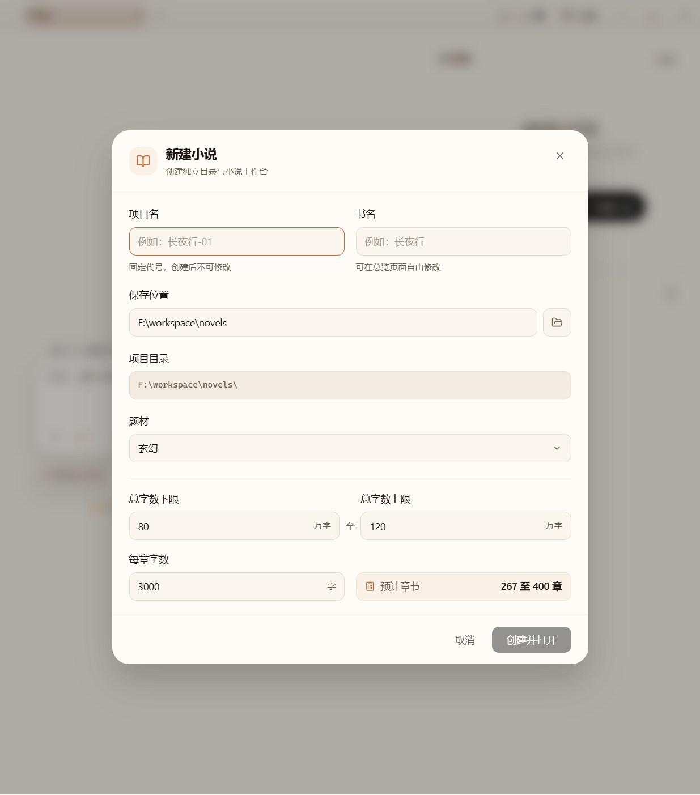
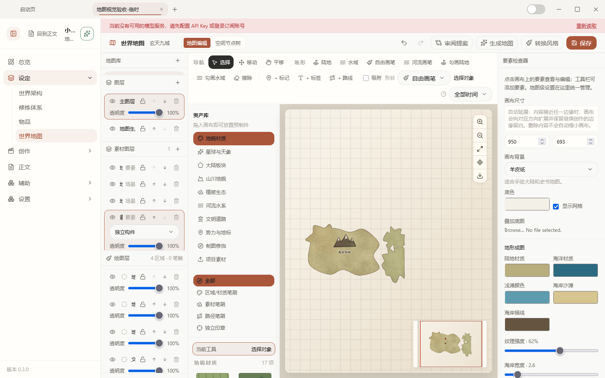
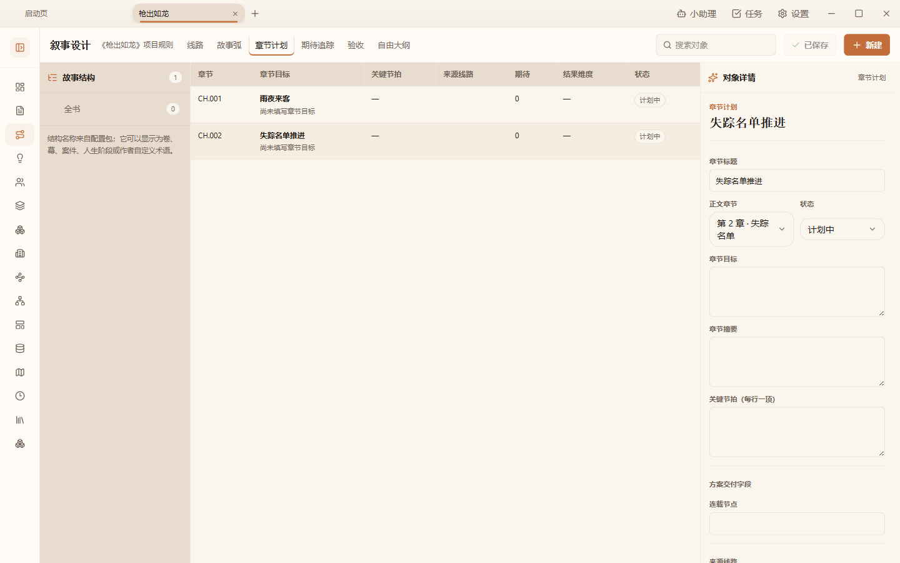
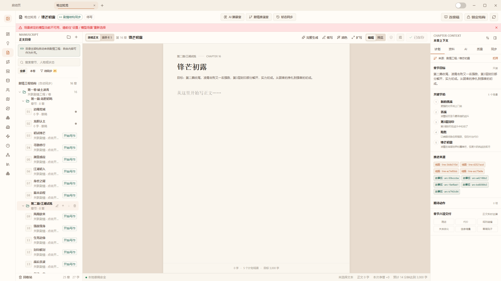
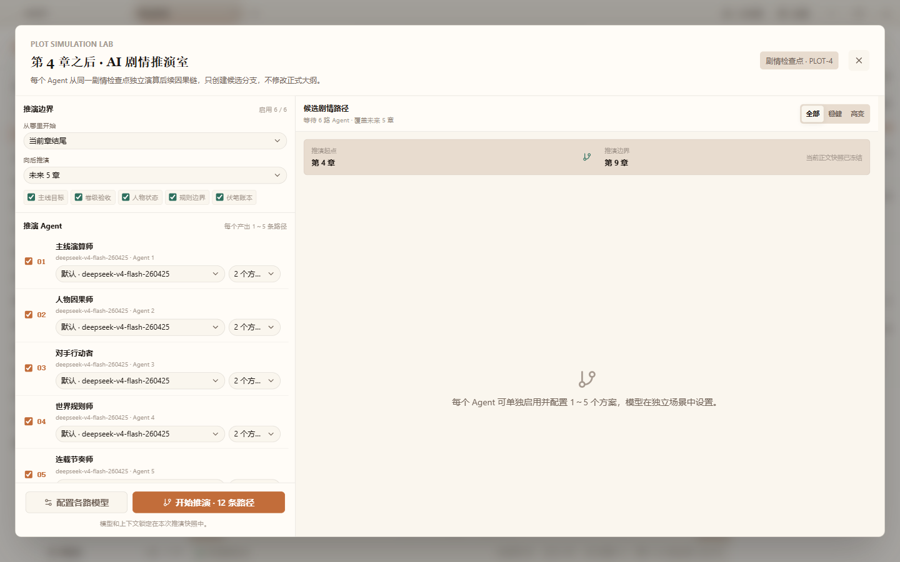
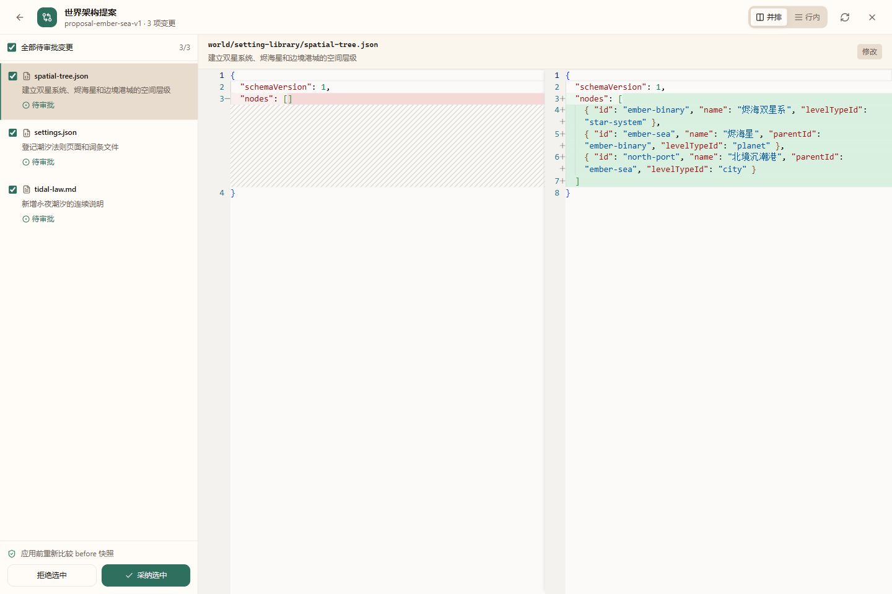

<div align="center">

# My Novel Studio

**把一部小说的世界、人物、剧情与正文，放进同一个可持续创作的工作室**

[中文](#chinese) · [English](#english) · [项目设计](Novel-Design.md) · [贡献指南](CONTRIBUTING.md)

[](LICENSE)
[](https://tauri.app/)
[](https://react.dev/)
[](https://www.typescriptlang.org/)



</div>

<a id="chinese"></a>

## My Novel Studio 是什么

My Novel Studio 是面向长篇与短篇小说创作的本地优先工作台。它把创作中最容易失散的几类事实放到同一部小说目录里：世界设定、人物关系、势力组织、时间线、剧情工程、正文、研究资料和知识图谱。

小说项目不是一张孤立的编辑页面，而是一套可以持续积累、检查、修改和备份的创作档案。Markdown 与 JSON 是项目的可移植事实源，项目目录可以独立移动、复制、提交 Git，也可以用其它编辑器继续处理。

## 从世界到正文

### 先建立可供写作依赖的世界

设定、地点、势力、物品、世界地图和修行体系拥有稳定 ID 与结构化关系。世界地图可以从架构事实生成提案，设定库保留页面、词条、空间层级和版本变更，作者始终可以审阅并决定哪些内容进入正式事实源。



### 让剧情成为可以检查的工程

剧情工程支持线路、故事弧、卷篇组目录、章节计划、节和段。章节可以关联正文、人物、线路与故事弧，故事编排视图根据真实关联投影章节泳道，不额外保存一份容易失真的时间表。



### 在连续性约束下写正文

正文工作台提供章节树、章节目标、关键节拍、来源线路和章节上下文。写作时可以回看前文、人物、设定、剧情和时间线，正文 Markdown 仍是唯一事实源，规划数据不会偷偷改写正文文件。



### 用推演和提案辅助判断

世界推演可以在明确的起止章节、规则边界和候选 Agent 配置下生成事件路径；AI 设计、批量生产和审查都先形成可比较、可拒绝、可采纳的提案，再由作者写入正式项目数据。





## 工作台能力

| 模块             | 用途                                              |
| ---------------- | ------------------------------------------------- |
| 总览             | 查看项目状态、创作进度、诊断和最近编辑内容        |
| 世界架构         | 管理设定库、地点、势力、物品、地图和空间层级      |
| 修行体系         | 维护本源、理论、资源、方法、能力、阵法和进阶关系  |
| 人物与势力       | 管理人物小传、角色弧光、灵魂、种族、组织与关联    |
| 时间线           | 管理日历、时期、事件、分支和可视化时间关系        |
| 剧情工程         | 组织线路、故事弧、目录、章节、节与段              |
| 正文             | 编写章节，核对章节上下文与连续性状态              |
| 灵感与资料       | 保存灵感、研究笔记和可供 AI 按需读取的资料        |
| 知识库           | 管理实体、关系和事实，支持跨模块引用与诊断        |
| 世界推演         | 在约束下生成事件候选并审阅故事路径                |
| 提示词与模型场景 | 管理 My Novel Studio 的默认提示词包和场景模型绑定 |

## AI 如何参与创作

My Novel Studio 复用宿主的 Agent Session，但小说领域的事实读取和写入由工作台协议约束：

- Agent 先按需读取项目事实，不把整部小说快照塞进启动消息。
- AI 设计结果先保存为草稿或提案，作者可以逐项比较差异、拒绝或采纳。
- 正式写入由对应领域 Repository 完成，并使用版本快照防止覆盖作者刚刚修改的内容。
- AI 可以协助世界构建、剧情规划、人物设计、时间线检查、灵感共创和正文方案，但不会绕过工作台直接改写事实源。

## 项目数据模型

每部小说都是独立目录，核心事实分层保存：

```text
<novel-root>/
|-- novel.json
|-- manuscript/       正文、章节索引、连续性状态与审阅记录
|-- narrative/        线路、故事弧、目录、章节计划与提案
|-- characters/       人物库、角色弧光与灵魂
|-- world/             世界架构、地图、物品与修行体系
|-- timeline/          日历、时期、分支与事件
|-- inspiration/       灵感记录
|-- research/          研究资料
|-- knowledge/         实体、关系与事实
|-- prompts/           提示词包与安装记录
`-- assets/            图片等二进制素材
```

项目目录中的文本统一使用 UTF-8，JSON 使用 2 空格缩进并以换行结尾，项目内路径使用 `/` 分隔。派生索引和向量缓存不属于小说事实源，可以删除并重建。

## 研发指引

My Novel Studio 是建立在 Workbench Platform 上的官方小说工作台。小说领域代码只能通过 Workbench SDK 使用宿主能力；工作区文件操作统一经过绑定项目根目录的 `WorkbenchStorage`，不能直接导入宿主 App、Chat、Config Store、Sidecar 或 Tauri API。

### 技术栈

| 层级       | 技术                                         |
| ---------- | -------------------------------------------- |
| 桌面框架   | Tauri v2 + Rust                              |
| 前端       | React 19 + TypeScript + Vite + TailwindCSS   |
| 工作台     | Workbench SDK 1.11，内置 `io.myagents.novel` |
| Agent 会话 | 宿主 Agent Session 与小说工作台内置工具      |
| 事实存储   | UTF-8 Markdown + JSON                        |
| 测试       | Vitest、Testing Library、Rust 测试           |

### 环境要求

- Node.js `>=22.0.0`，推荐 Node.js 24。
- npm，仓库当前声明 `npm@11.13.0`。
- Rust 通过 [rustup](https://rustup.rs) 安装，实际 toolchain 由 [rust-toolchain.toml](rust-toolchain.toml) 固定。
- macOS 13+、Windows 10+ 或 Linux Ubuntu 22.04+ / Debian 12+。

### 本地开发

macOS / Linux：

```bash
git clone <repository-url>
cd MyAgents
./setup.sh
./start_dev.sh
```

Windows：

```powershell
git clone <repository-url>
cd MyAgents
.\setup_windows.ps1
.\build_windows.ps1
```

Windows 日常测试打包统一使用根目录入口：

```powershell
$env:MYAGENTS_PACKAGE_NO_PAUSE='1'; & .\Package-MyAgents-Test.cmd
```

只检查打包环境而不构建：

```powershell
$env:MYAGENTS_PACKAGE_NO_PAUSE='1'; & .\Package-MyAgents-Test.cmd -ValidateOnly
```

### 常用命令

```bash
# 启动开发环境
./start_dev.sh

# 类型检查
npm run typecheck

# Lint 与架构边界检查
npm run lint

# 测试分层
npm run test:classification
npm run test:unit
npm run test:dom
npm run test:integration
npm test
```

### 项目结构

```text
src/renderer/workbenches/novel/  My Novel Studio 工作台
src/renderer/workbench-sdk/      Workbench 宿主接口
src/shared/workbenches/novel/    小说领域共享逻辑
src/server/tools/                小说工作台内置工具
src-tauri/                       Tauri Rust 层
specs/                           架构、设计、技术文档与截图资源
```

### 设计文档

- [小说工作台关键设计](Novel-Design.md)
- [Workbench Platform](specs/tech_docs/workbench_platform.md)
- [小说灵感模块](specs/tech_docs/novel_inspiration.md)
- [世界推演设计方案](世界推演设计方案.md)
- [架构总览](specs/ARCHITECTURE.md)

修改小说工作台前，应先阅读与目标模块匹配的设计文档，确认事实源、Repository、Agent 协议和宿主边界，再开始编码。

### 贡献前检查

提交前至少运行：

```bash
npm run typecheck
npm run lint
npm run test:classification
npm run test:unit
npm run test:dom
```

涉及 Rust、Tauri 命令、Agent Session、文件 IO 或跨进程边界的改动，还应运行对应的集成测试。

提交信息遵循 Conventional Commits：

```text
feat: add ...
fix: handle ...
docs: update ...
refactor: simplify ...
test: cover ...
chore: bump ...
```

## 许可证

本项目采用 [GNU Affero General Public License v3.0](LICENSE)（`AGPL-3.0-only`）。分发修改版、通过网络向用户提供修改版等场景需要履行 AGPL，包括在适用时提供对应源码。

完整说明见 [LICENSING.md](LICENSING.md)，第三方组件继续适用各自许可证，详见 [THIRD_PARTY_NOTICES.md](THIRD_PARTY_NOTICES.md)。

<a id="english"></a>

## English

## What Is My Novel Studio

My Novel Studio is a local-first writing workspace for long-form and short-form fiction. It keeps the facts that make a novel coherent in one project directory: worldbuilding, characters, factions, timelines, narrative engineering, manuscript chapters, research notes, and a knowledge graph.

A novel project is more than an editor view. It is a durable creative archive that can be accumulated, checked, revised, backed up, moved, and versioned with Git. Markdown and JSON are the portable sources of truth, so the project can continue in another editor when needed.

## From World To Manuscript

### Build a world your chapters can depend on

Settings, locations, factions, items, maps, and cultivation systems use stable IDs and structured relationships. Generated maps and design tasks produce reviewable proposals; authors decide which changes enter the formal project facts.


### Treat story planning as an inspectable system

Narrative engineering supports plot lines, story arcs, volume and section directories, chapter plans, scenes, and beats. The orchestration view is projected from real chapter relationships instead of storing a second, conflicting schedule.


### Write with continuity context

The manuscript workspace combines a chapter tree, chapter goals, key beats, source lines, and chapter context. Writers can inspect prior chapters, characters, settings, narrative plans, and timelines without making the planning layer rewrite the manuscript Markdown.


### Use simulation and proposals to support judgment

World simulation generates event paths within explicit chapter ranges, rules, and Agent configurations. AI design, batch creation, and review produce comparable proposals first; authors approve or reject each change before it becomes project data.


## Workbench Areas

| Area                     | Purpose                                                                     |
| ------------------------ | --------------------------------------------------------------------------- |
| Overview                 | Project status, progress, diagnostics, and recent edits                     |
| World architecture       | Settings library, locations, factions, items, maps, and spatial hierarchy   |
| Cultivation systems      | Origins, theory, resources, methods, abilities, formations, and progression |
| Characters and factions  | Character profiles, arcs, souls, groups, and relationships                  |
| Timeline                 | Calendars, periods, events, branches, and timeline views                    |
| Narrative engineering    | Plot lines, arcs, directories, chapters, scenes, and beats                  |
| Manuscript               | Chapter writing, goals, context, and continuity checks                      |
| Inspiration and research | Ideas, notes, and source material for creative work                         |
| Knowledge graph          | Entities, relations, facts, cross-module references, and diagnostics        |
| World simulation         | Constrained event candidates and story paths                                |
| Prompts and model scenes | My Novel Studio prompt packs and per-scene model bindings                   |

## AI In The Writing Loop

My Novel Studio reuses the host Agent Session while keeping novel facts and writes under workbench protocols:

- Agents read project facts on demand instead of serializing an entire novel into the launch message.
- AI output becomes a draft or proposal first, so authors can compare, reject, or adopt changes item by item.
- Domain repositories perform formal writes using revision snapshots to avoid overwriting a recent author edit.
- AI can assist with worldbuilding, narrative planning, character design, timeline checks, inspiration, and manuscript plans without bypassing the project fact model.

## Project Data Model

Each novel is an independent directory:

```text
<novel-root>/
|-- novel.json
|-- manuscript/       chapters, indexes, continuity state, and review records
|-- narrative/        lines, arcs, directories, chapter plans, and proposals
|-- characters/       character library, arcs, and souls
|-- world/             settings, maps, items, and cultivation systems
|-- timeline/          calendars, periods, branches, and events
|-- inspiration/       inspiration records
|-- research/          research notes
|-- knowledge/         entities, relations, and facts
|-- prompts/           prompt packs and installations
`-- assets/            binary creative assets
```

Project text is UTF-8, JSON uses two-space indentation and a trailing newline, and project paths use `/`. Derived indexes and vector caches are rebuildable and are not part of the novel's source of truth.

## Development Guide

My Novel Studio is the official novel workbench built on the Workbench Platform. Novel code uses host capabilities through the Workbench SDK; project file operations go through `WorkbenchStorage` bound to the current novel root. The workbench does not import host App, Chat, Config Store, Sidecar, or Tauri internals directly.

### Stack

| Layer           | Technology                                       |
| --------------- | ------------------------------------------------ |
| Desktop shell   | Tauri v2 + Rust                                  |
| Renderer        | React 19 + TypeScript + Vite + TailwindCSS       |
| Workbench       | Workbench SDK 1.11, built-in `io.myagents.novel` |
| Agent sessions  | Host Agent Session and novel workbench tools     |
| Source of truth | UTF-8 Markdown + JSON                            |
| Tests           | Vitest, Testing Library, and Rust tests          |

### Requirements

- Node.js `>=22.0.0`, Node.js 24 recommended.
- npm, with `npm@11.13.0` declared by the repository.
- Rust installed through [rustup](https://rustup.rs), with the toolchain pinned by [rust-toolchain.toml](rust-toolchain.toml).
- macOS 13+, Windows 10+, or Linux Ubuntu 22.04+ / Debian 12+.

### Local development

macOS / Linux:

```bash
git clone <repository-url>
cd MyAgents
./setup.sh
./start_dev.sh
```

Windows:

```powershell
git clone <repository-url>
cd MyAgents
.\setup_windows.ps1
.\build_windows.ps1
```

For the daily Windows test package:

```powershell
$env:MYAGENTS_PACKAGE_NO_PAUSE='1'; & .\Package-MyAgents-Test.cmd
```

Validate the packaging environment without building:

```powershell
$env:MYAGENTS_PACKAGE_NO_PAUSE='1'; & .\Package-MyAgents-Test.cmd -ValidateOnly
```

### Common commands

```bash
./start_dev.sh
npm run typecheck
npm run lint
npm run test:classification
npm run test:unit
npm run test:dom
npm run test:integration
npm test
```

### Repository layout

```text
src/renderer/workbenches/novel/  My Novel Studio workbench
src/renderer/workbench-sdk/      Workbench host interfaces
src/shared/workbenches/novel/    Shared novel-domain logic
src/server/tools/                Novel workbench built-in tools
src-tauri/                       Tauri Rust layer
specs/                           Architecture, design, docs, and screenshots
```

### Design references

- [Novel Workbench Design](Novel-Design.md)
- [Workbench Platform](specs/tech_docs/workbench_platform.md)
- [Novel Inspiration](specs/tech_docs/novel_inspiration.md)
- [World Simulation Design](世界推演设计方案.md)
- [Architecture](specs/ARCHITECTURE.md)

Read the design document for the target module before coding. Confirm the source of truth, repository owner, Agent protocol, and host boundary before making changes.

### Pre-commit checks

At minimum:

```bash
npm run typecheck
npm run lint
npm run test:classification
npm run test:unit
npm run test:dom
```

Changes involving Rust, Tauri commands, Agent sessions, file IO, or process boundaries should also run the matching integration tests.

Commit messages use Conventional Commits:

```text
feat: add ...
fix: handle ...
docs: update ...
refactor: simplify ...
test: cover ...
chore: bump ...
```

## License

This project is licensed under the [GNU Affero General Public License v3.0](LICENSE) (`AGPL-3.0-only`). Modified distributions and network services based on modified versions must comply with the AGPL, including providing corresponding source where applicable.

See [LICENSING.md](LICENSING.md) for the full terms and [THIRD_PARTY_NOTICES.md](THIRD_PARTY_NOTICES.md) for third-party licenses.
