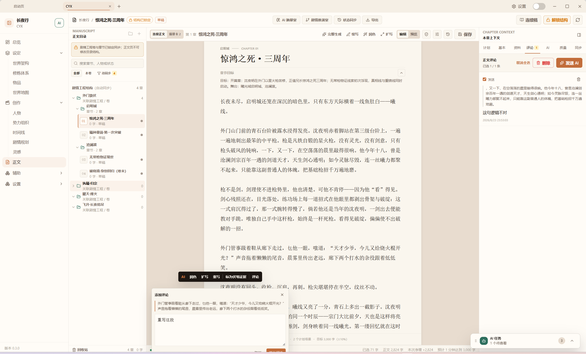
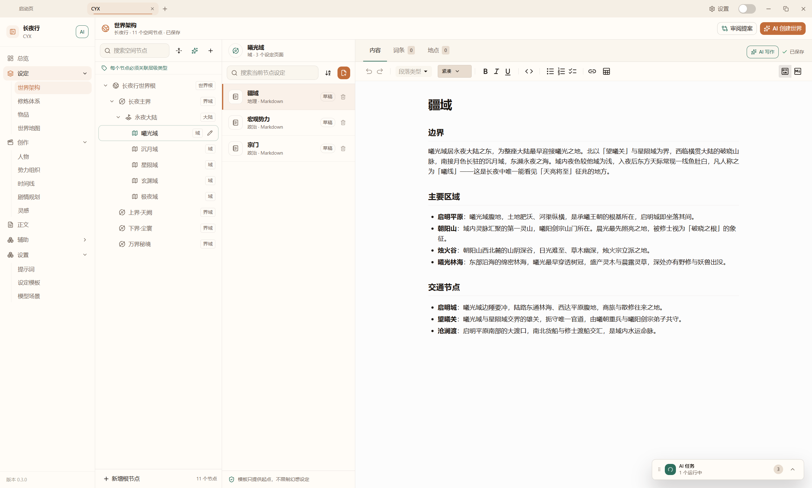
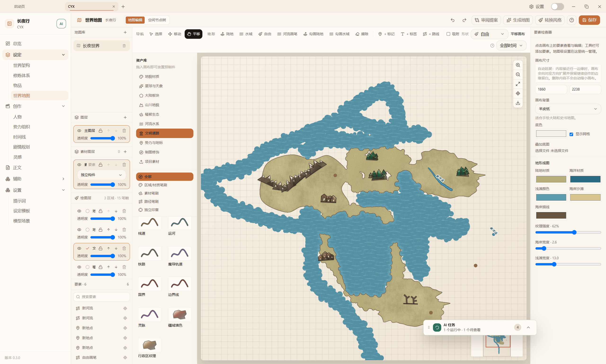
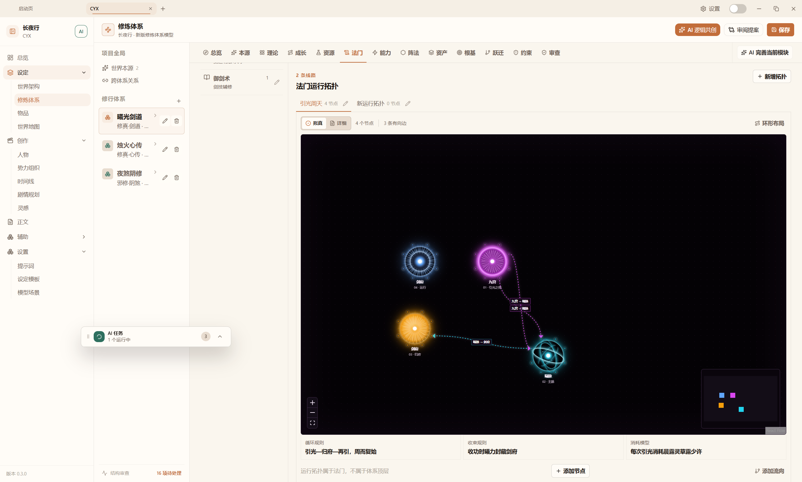
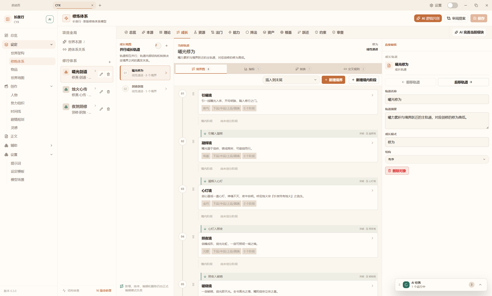
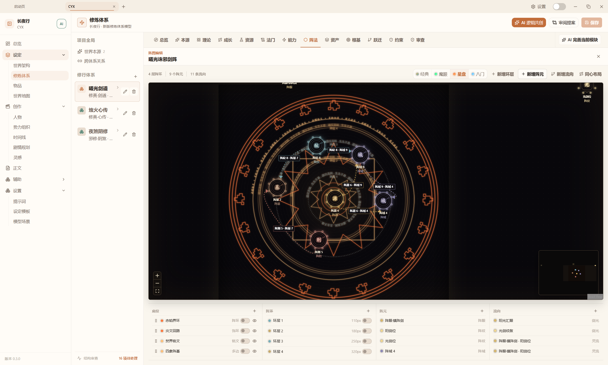
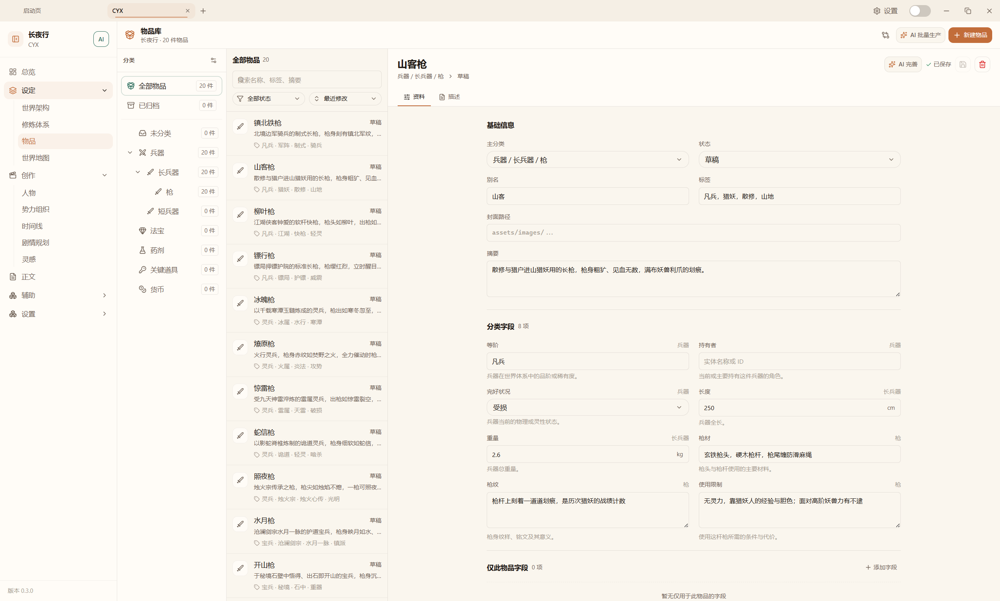
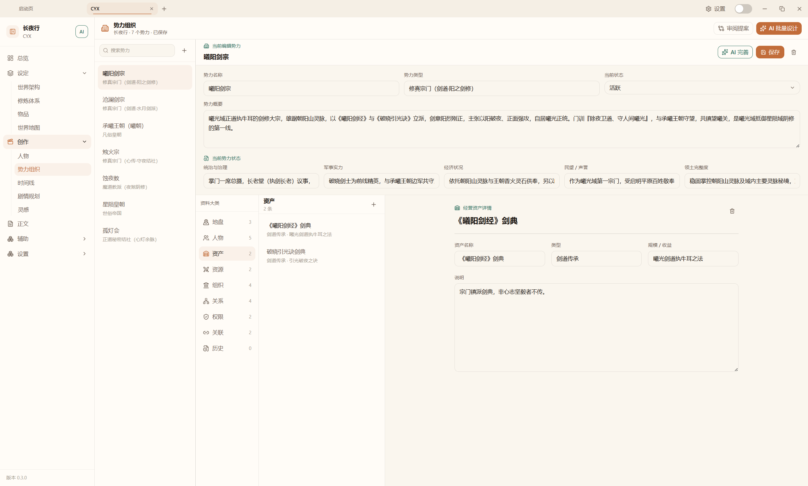
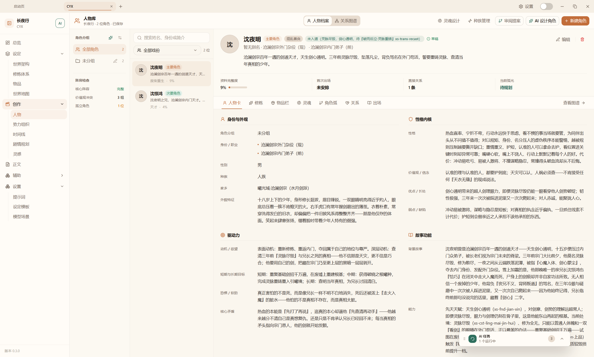
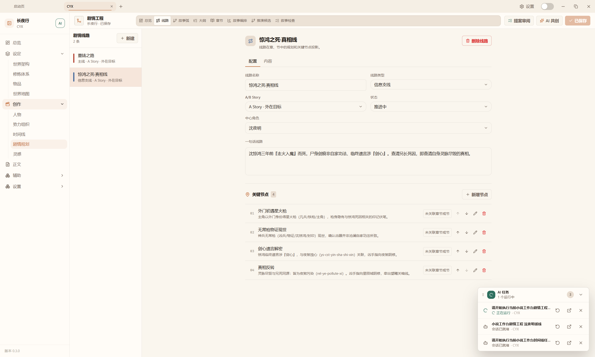

<div align="center">

# My Novel Studio

**把世界设定、人物关系、剧情规划与正文写作放进同一个小说项目**

[功能预览](#功能预览) · [项目文件](#项目文件) · [本地开发](#本地开发) · [设计文档](#设计文档)

[](LICENSE)
[](https://tauri.app/)
[](https://react.dev/)
[](https://www.typescriptlang.org/)

</div>



My Novel Studio 是面向小说创作的本地优先桌面工作室。一部小说对应一个独立项目目录，世界设定、修炼体系、人物、势力、物品、时间线、剧情规划和正文都在这里持续积累。项目事实保存为可读的 Markdown 与 JSON，可以移动、备份、提交 Git，也可以交给其它编辑器继续处理。

工作台里的 AI 参与资料完善、方案共创和正文辅助，但不会绕过作者直接改写正式数据。需要落地的结果先进入草稿或提案，确认后再写入项目文件。

## 功能预览

### 世界架构

用空间树组织世界、界域、大陆、城市和其它层级节点。每个节点可以维护多篇 Markdown 设定页，并把词条、地点与正文引用留在同一套结构中。



### 世界地图

地图编辑器提供陆地、水域、河流、道路、区域、标记、标签和自由绘制工具。图层、素材、画布样式与元素属性分开管理，既能从世界事实生成地图提案，也能在画布上继续细化。



### 修炼体系

修炼体系不只是一份境界清单。工作台分别管理本源、理论、成长轨道、资源、法门、能力、阵法、资产、根基、跃迁与约束，并提供结构审查和提案审阅。

法门运行拓扑把节点与流向画成可检查的关系图，循环、收束与消耗规则可以直接对应到具体法门。



成长轨道记录境界、阶段、指标、转换和交叉规则，适合表达并行路线、分支进阶和境界间的真实关系。



阵法编辑器以阵环、阵元、流向和底纹组成可视化结构，保留阵位层级和连接关系。



### 物品库

物品按分类树管理，分类可以定义并继承自己的字段方案。基础资料、分类字段、物品专属字段与 Markdown 描述各有明确归属，武器、法宝、药剂、货币或自定义类别可以共用同一套资料库。



### 势力组织

势力档案覆盖治理、军事实力、经济、声誉与领土状态，并进一步记录地盘、成员、资产、资源、内部组织、外部关系、权限和历史。人物、地点与物品只保存稳定关联，不会被势力页面反向覆盖。



### 人物库

人物档案集中保存身份、外观、性格、价值观、动机、目标、弱点、能力与故事功能。人物关系、角色弧、出场记录、物品栏和灵魂设计围绕同一人物 ID 展开，方便在写作前后核对角色状态。



### 剧情工程

线路、故事弧、卷篇组大纲、章节、故事编排和叙事检查共用一套剧情事实。关键节点可以关联章节与节，正文完成后仍能回到线路查看铺垫、反转和目标是否真正落地。



### 正文创作

正文工作区把剧情工程目录、章节目标和 Markdown 正文放在同一视图。右侧章节上下文汇总计划、资料、评论、AI、质量与同步状态；选中文段后可以添加评论，或把明确的局部任务交给 AI。结构锁定后，正文侧不能改动由剧情工程同步的目录结构。


## AI 协作方式

- 通用 AI 按钮只打开项目对话窗口，由作者决定何时发送任务。
- 世界、人物、势力、物品、剧情和正文功能按需读取项目事实，不把整部小说复制进启动消息。
- AI 生成的结构化内容先成为草稿或提案，支持比较、拒绝、修改和采纳。
- 正式写入由对应领域的数据层完成，并检查生成时的版本快照，避免覆盖作者刚刚保存的修改。
- 长流程会话与一次性局部生成共用项目内的模型场景设置。

## 项目文件

每部小说都是一个可独立移动的目录。主要事实源如下：

```text
<novel-root>/
|-- novel.json          项目元数据
|-- manuscript/         正文、章节索引、评论与连续性状态
|-- narrative/          线路、故事弧、大纲、章节计划与提案
|-- characters/         人物、分组、角色弧与灵魂
|-- world/              世界架构、地图、势力、物品与修炼体系
|-- timeline/           日历、时期、分支与事件
|-- inspiration/        灵感记录
|-- research/           研究资料
|-- knowledge/          实体、关系与事实
|-- prompts/            提示词包与安装记录
`-- assets/             图片和其它二进制素材
```

文本统一使用 UTF-8，JSON 使用 2 空格缩进，项目内路径使用 `/`。派生索引和向量缓存不属于小说事实源，可以删除后重建。

## 技术栈

| 层级       | 技术                                         |
| ---------- | -------------------------------------------- |
| 桌面应用   | Tauri v2 + Rust                              |
| 界面       | React 19 + TypeScript + Vite + Tailwind CSS  |
| 小说工作台 | Workbench SDK 1.11，内置 `io.myagents.novel` |
| AI 会话    | 项目级 Agent Session 与小说领域工具          |
| 事实存储   | UTF-8 Markdown + JSON                        |
| 测试       | Vitest、Testing Library、Rust 测试           |

## 本地开发

### 环境要求

- Node.js `>=22.0.0`，推荐 Node.js 24
- npm，仓库声明版本为 `npm@11.13.0`
- 通过 [rustup](https://rustup.rs) 安装 Rust，工具链版本由 [rust-toolchain.toml](rust-toolchain.toml) 固定
- macOS 13+、Windows 10+，或 Ubuntu 22.04+ / Debian 12+

### 启动

macOS / Linux：

```bash
git clone <repository-url>
cd MyAgents
./setup.sh
./start_dev.sh
```

Windows：

```powershell
git clone <repository-url>
cd MyAgents
.\setup_windows.ps1
.\Start-MyAgents-Dev.cmd
```

Windows 日常测试打包使用仓库根目录的统一入口：

```powershell
$env:MYAGENTS_PACKAGE_NO_PAUSE='1'; & .\Package-MyAgents-Test.cmd
```

只检查打包环境：

```powershell
$env:MYAGENTS_PACKAGE_NO_PAUSE='1'; & .\Package-MyAgents-Test.cmd -ValidateOnly
```

### 常用检查

```bash
npm run typecheck
npm run lint
npm run test:classification
npm run test:unit
npm run test:dom
npm run test:integration
```

## 设计文档

- [小说工作台关键设计](Novel-Design.md)
- [Workbench Platform](specs/tech_docs/workbench_platform.md)
- [架构总览](specs/ARCHITECTURE.md)
- [小说灵感模块](specs/tech_docs/novel_inspiration.md)
- [世界推演设计方案](世界推演设计方案.md)
- [贡献指南](CONTRIBUTING.md)

修改功能前，应先确认目标模块的事实源、数据层职责、AI 协议和工作台边界。项目结构和完整约束以设计文档、类型与测试为准。

## 许可证

本项目采用 [GNU Affero General Public License v3.0](LICENSE)（`AGPL-3.0-only`）。完整说明见 [LICENSING.md](LICENSING.md)，第三方组件许可证见 [THIRD_PARTY_NOTICES.md](THIRD_PARTY_NOTICES.md)。商业授权请联系 [myagents.io@gmail.com](mailto:myagents.io@gmail.com)。
