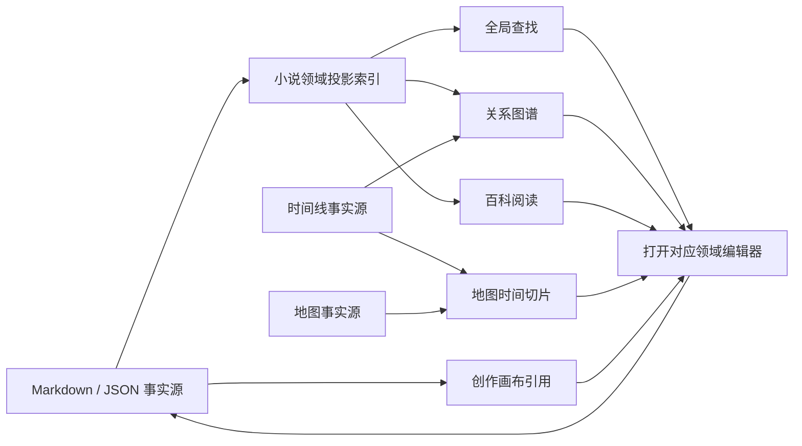

# 小说工作台「借鉴 VVD」产品设计方案（评审稿）

> 状态：**待评审提议**。本文是 2026-07-25 Codex 会话（`019f975f-14ae-7301-857c-b456ac2a5ae8`）调研 [vvd.world](https://vvd.world/) 后产出的产品设计方案落盘稿，尚未进入实现排期。
> 生效规则：只有被评审确认的条目才进入 `Novel-Design.md`；本文不构成已确认决策。实现、评审和 Agent 开发仍以 `Novel-Design.md`、`specs/tech_docs/workbench_platform.md` 与各模块技术文档为准。
> 与当前实现的关系：截至 2026-08-01，仓库已落地与本方案部分方向重合的增量（见 §9 对照），本方案在评审时应以实际代码为准重新核对。

## 1. 调研结论（VVD 公开能力盘点）

以 VVD 公开首页、时间线 Beta 说明与定价页为准（实际工作区需登录，未纳入判断）。其公开能力：编辑器、自由画布（Canvas）、关系树、互动地图、世界 Wiki、引导模板、实时协作、Quill AI（Alpha）。

### 值得借鉴（按优先级）

| 借鉴方向 | 当前小说工作台 | 建议 | 优先级 |
|---|---|---|---|
| 跨域关系图 | 人物库已有「中心人物直接关系图」（D3）；知识库已有节点、边、来源，但主要是列表界面 | 知识库增加「列表 / 图谱」视图：统一呈现人物、势力、地点、物品、事件、章节关系；类型筛选、1～3 跳展开、边类型过滤、来源定位、时间切片 | P0 |
| 全局搜索与快速新建 | 搜索散落在各模块，一级导航较多 | 全工作台 `Ctrl+K` 命令面板：搜索所有领域实体并定位到具体实体，快速新建人物、事件、灵感、章节等 | P0 |
| 真正可编辑的互动地图 | 地图此前是硬编码 SVG 原型 | 独立地图编辑器：标记点、区域、多边形、路线、标签、图层、底图；要素关联稳定 ID；按时间线切换历史切片 | P1 |
| 世界 Wiki | 已有设定库与知识图谱，无连续阅读与发布形态 | 项目内「百科阅读模式」+ 静态站点导出（目录、别名、反向链接、关系、地图、时间线）；暂不做托管与自定义域名 | P1 |
| 创作 Canvas | 剧情工程、灵感、人物各自独立 | 灵感模块内白板视图；卡片只引用现有实体 ID，位置/分组/连线属于视图状态 | P2 |

### 不建议照搬

- **时间线**：现有工作台已有多历法、纪元树、分支、叙事顺序、因果、状态变化与伏笔，明显比 VVD 公开 Beta 更深入。只借鉴「默认界面简单、复杂字段渐进展开」的体验。
- **Quill AI**：公开页仅标 Alpha，无法确认能力。MyAgents 已有提示词包、模型场景、完整 Agent 会话与提案审阅，无需再造独立 AI 助手。
- **实时协作**：会引入云端权限、在线状态、CRDT 与冲突模型，与本地文件事实源架构不同。短期可先做 Git 差异审阅、评论与静态分享。

## 2. 总体原则

**一处维护事实，多处查看、联结和呈现；可视化层不另造事实源，AI 结果必须经过提案审阅。**

- Markdown / JSON 是唯一可移植事实源；图谱、地图、画布只保存视图状态与实体引用，不复制名称、概要等派生字段。
- 新增能力复用现有稳定 ID、知识图谱、时间线事实源与提案审阅链路，不引入第二套抽象。
- 不继续增加大量一级导航；新能力尽量归入现有模块的视图/入口。

## 3. 产品结构

| 现有模块 | 调整后结构 |
|---|---|
| 工作台导航顶部 | 新增「查找」入口；`Ctrl+K` 打开紧凑命令面板 |
| 知识库 | 增加「探索 / 图谱 / 百科」三个视图 |
| 世界地图 | 从静态原型升级为独立地图编辑器 |
| 灵感 | 在「列表 / 看板」之外增加「画布」 |
| 时间线 | 保留现有能力，只简化默认视图 |
| 设置 | 增加「百科导出」配置，不单独增加 Wiki 导航 |



## 4. 全局查找与快速新建（P0）

- 入口：导航栏搜索图标、`Ctrl+K`、总览页搜索框。`Ctrl+K` 展示前 8 个结果与常用命令；「查看全部」进入完整查找页。
- 完整页三栏：左侧类型与状态筛选、中间结果列表、右侧内容预览与来源。
- 搜索范围：人物、势力、物品、地点、设定、事件、章节、剧情规划、灵感、资料文件。
- 排序：名称完全匹配 → 别名匹配 → 标题匹配 → 正文内容匹配。点击必须定位到具体实体，不能只打开模块首页。
- 快速命令：新建章节、人物、势力、物品、事件、灵感、地图。新建先进入对应编辑器草稿，不直接写盘。
- 平台能力：MyAgents 已有 Rust 层 Tantivy 搜索（`specs/tech_docs/search_architecture.md`），但当前 `WorkbenchStorage` 能力（`src/renderer/workbench-sdk/types.ts`）没有搜索端口。正确方案是**新增通用 `WorkbenchSearch` 宿主端口**，由小说工作台通过 SDK 使用，而不是直接导入宿主 `searchClient`。浏览器开发模式用领域索引降级（可搜结构化实体），并提示「正文全文搜索仅桌面模式可用」。

## 5. 跨域关系图谱（P0）

- 位置：知识库新增「图谱」页。布局：左侧筛选、中央无限画布、右侧检查器。
- 节点类型：人物、势力、地点、物品、事件、章节、设定、词条、事实。
- 边类型：人物关系、成员归属、持有、发生地点、事件参与、因果、章节出现、设定包含、普通引用。
- 交互：
  - 单击节点：右侧摘要、直接关系、来源。
  - 双击节点：设为中心，仅展开指定跳数。
  - 点击边：关系类型、方向、有效时间、来源。
  - 类型筛选、跳数控制（1/2/3 跳，默认 1）、时间切片（按时间线事件或章节查看当时有效关系）。
  - 「编辑来源」：跳转到人物库、势力库、时间线等真正的事实所有者。
- 图谱**只读**，不允许直接改边；「建立关系」打开对应领域编辑器或生成关系草稿。
- 现有 `CharacterLibraryPrototype` 人物关系图保留为人物页局部视图；知识库图谱负责全域关系。
- 时间信息不完整必须标记「时间未知」，不得使用假时间切片；节点超过 200 个默认折叠。
- 数据源：`knowledgeGraph.ts` 已能扫描全部 `.md/.json` 构建节点/边并带 sourceRefs，可扩展边语义（事件.characterIds、角色.inventory.itemId 等库间引用目前不会自动进图）。

## 6. 互动地图编辑器（P1）

- 布局：左侧地图与图层树、中间地图画布、右侧选中要素检查器；顶部提供地图选择、新建、保存、撤销、重做、Agent 提案入口。
- 地图类型创建时确定：大陆平面图、星球投影、多元宇宙拓扑、平行世界分支；不再作为临时显示切换。
- 要素：标记点、文本标签、区域、多边形、路线、拓扑节点。每个要素可关联地点、势力、物品、事件稳定 ID；名称、概要等从对应资料库派生，地图不复制。
- 存储结构：
  ```text
  world/maps/index.json
  world/maps/records/<map-id>.json
  assets/images/maps/<map-id>/*
  ```
- 地图记录保存投影类型、坐标空间、图层、几何要素、实体引用、时间有效范围；缩放/选中/临时视口只进应用缓存。
- 时间切片由 `timeline/index.json` 驱动；无时间信息的要素保持可见并标记「长期或时间未知」。
- Agent 生成地图只能写提案；审阅按新增/修改/删除要素列差异、逐项接受；正式保存继续用 `expectedContent` 防外部修改覆盖。

## 7. 百科阅读与静态导出（P1）

- 知识库「百科」视图 = 面向作者的连续阅读模式，不新建内容副本。
- 页面：左侧分类目录、中央条目正文、右侧本页目录与反向引用。条目依次展示名称、别名、摘要、结构化字段、Markdown 正文、关系、相关事件、正文出场、来源文件。
- 编辑按钮必须跳回事实所有者；Wiki 内不直接编辑人物/势力/物品，只允许修改展示配置。
- Markdown 实体引用建议稳定形式：`[[character:char-luoyan|洛言]]`；可视化编辑器负责插入，Markdown 仍可人工阅读；旧的 `[[洛言]]` 继续兼容，名称重复时提示选择稳定实体。
- 静态导出第二阶段：项目只保存 `publishing/wiki-profile.json`（站点标题、主题、显式包含的实体范围）；生成目录由用户选择，不写入小说事实目录。默认排除正文、灵感、研究笔记、Agent 提案与未选择条目。输出含静态搜索索引、相对链接、图片资源、基础 SEO 元数据。暂不提供托管、自定义域名或任意 CSS。

## 8. 创作画布（P2）

- 位置：灵感模块内，定位为推演空间而非第二套剧情工程。
- 节点：灵感、人物、地点、势力、物品、事件、章节、分组框。新增便签时后台同步创建一条灵感记录；画布节点只保存引用、坐标、尺寸、样式。
- 连线默认只是视觉推演，不进入知识图谱；明确执行「采纳为正式关系」时才生成对应领域草稿或 Agent 提案。
- 存储：
  ```text
  inspiration/boards/index.json
  inspiration/boards/<board-id>.json
  ```
- 依赖：`@xyflow/react@12.11.2`（已在 `package.json`）直接承担缩放、拖动、连线、多选、分组，不自行实现画布引擎。

## 9. 通用状态与安全边界

- 所有模块覆盖：首次空白、加载、索引过期、来源失效、外部修改冲突、数据量过大、只读继承状态。
- 图形页面必须提供等价列表视图；节点/路线/关系同时用文字、图标与颜色；支持键盘选择、明确焦点、减少动效；可从图形元素直接跳回可编辑来源。
- 既有小说惰性创建新文件，不因普通打开重写项目；任何 Schema 升级使用独立版本号；地图、画布、百科配置失败不得影响正文、人物库、时间线继续使用。

## 10. 实施阶段

| 阶段 | 交付内容 |
|---|---|
| 基础层 | `WorkbenchSearch` 宿主端口、小说领域投影索引、跨模块实体定位控制器 |
| 第一阶段 | 全局查找、知识库图谱、来源跳转、基础性能限制 |
| 第二阶段 | 地图 Schema、Repository、编辑器、时间切片、冲突保护 |
| 第三阶段 | 百科阅读模式、稳定实体链接、静态导出 |
| 第四阶段 | 灵感画布、引用节点、关系提案、AI 整理入口 |

首阶段验收目标：热搜索 100ms 内出结果；200 个可见节点的图谱 1 秒内可交互；任何结果可定位到具体实体；来源丢失时明确提示且不崩溃；键盘可完成搜索、筛选、选择、打开来源。

## 11. 与当前实现对照（2026-08-01 复核）

以下增量已在仓库落地或部分落地，评审本方案时请以实际代码为准：

| 方案方向 | 当前状态 |
|---|---|
| 互动地图 | **部分落地**：`WorldMapPrototype.tsx` 已从硬编码 SVG 原型重写为消费 `world/setting-library/spatial-tree.json` 的数据驱动地图（层级树渲染、搜索、节点详情、统计）。尚未实现方案要求的要素编辑、图层、几何持久化（`world/maps/`）、时间切片与 Agent 提案。 |
| 资料 / 百科 | **部分落地**：`research` 路由已从占位改为资料库（`research/` 目录 Markdown 浏览、搜索、新建、编辑、删除）。尚未实现百科阅读模式、稳定实体链接与静态导出。 |
| 灵感 → 剧情 | **已落地**：灵感详情可一键转为剧情工程章节规划（含来源标记）；正文状态变更自动回流章计划状态。 |
| 跨域关系图谱 | **未实施**：知识库仍为列表界面；`knowledgeGraph.ts` 已有全库扫描基础，但库间引用边语义（事件.characterIds、角色.inventory.itemId 等）未入图。 |
| 全局搜索 / 快速新建 | **未实施**：需先新增 `WorkbenchSearch` 宿主端口（平台 API 扩展），`Ctrl+K` 命令面板未实现。 |
| 创作画布 | **未实施**：`@xyflow/react` 依赖已就绪，`inspiration/boards/` 未初始化。 |
| 跨库引用完整性 | **已落地**（基础层，非本方案范围但相关）：时间线/势力保存时跨库引用校验、删除保护、反向引用查询已实现（`crossLibraryReferences.ts`）。 |

## 12. 待拍板事项

1. **全局搜索的端口归属**：新增 `WorkbenchSearch` 宿主端口是平台 API 扩展，需确认由 MyAgents Core 负责实现（Tantivy 复用），工作台只消费 SDK 能力。
2. **图谱只读**：默认拍板为只读 + 「建立关系」走领域编辑器/提案；不提供图内直改。
3. **地图事实归属**：地图独立拥有几何事实（`world/maps/`），实体字段从资料库派生。
4. **画布连线默认非事实**：只有「采纳为正式关系」才写入知识图谱或生成提案。
5. **Wiki 先内部后静态导出**：托管、自定义域名、任意 CSS 继续延期。
6. **实时协作继续延期**：短期以 Git 差异审阅、评论、静态分享代替。

> 本文为评审稿：未修改任何仓库代码（截至 2026-08-01 的落地增量见 §11，均来自独立的功能完善工作，非本方案实施）。
