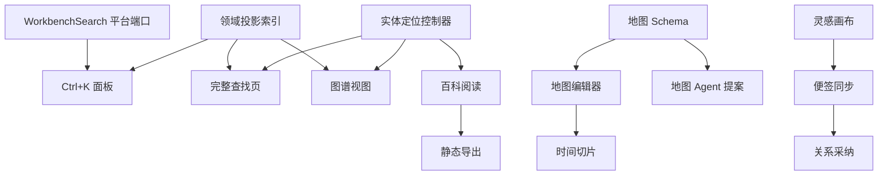

# 小说工作台「借鉴 VVD」实施方案 · 事项清单

> 依据：`specs/tech_docs/novel_workbench_vvd_inspired_plan.md`（评审稿）。本文把方案拆解为可排期的实施事项；每项含目标、涉及模块、依赖、验收标准。**尚未实施**，供评审与排期使用。
> 编号约定：T = Task；`[平台]` 标记涉及 MyAgents Core / workbench-sdk 的跨 owner 改动，需平台侧评审；`[novel]` 为小说工作台内部任务。

---

## 基础层（所有方向的前置）

### T1 `[平台]` WorkbenchSearch 宿主端口
- 目标：让工作台通过 SDK 使用宿主 Tantivy 全文搜索，而不是直接导入宿主 `searchClient`。
- 内容：`src/shared/workbench-sdk` 增加搜索能力定义（查询参数、结果结构、scope 限定到工作区根）；renderer SDK 暴露 `context.search`；宿主实现复用 `specs/tech_docs/search_architecture.md` 的 Rust `SearchEngine`；浏览器开发模式降级为领域索引并提示「正文全文搜索仅桌面模式可用」。
- 涉及：`src/shared/workbench-sdk/`、`src/renderer/workbench-sdk/`、App/ConfigProvider 搜索接线、`src/renderer/api/searchClient.ts`。
- 依赖：无（但被 T4/T5 依赖）。
- 验收：工作台可发起工作区级搜索并拿到带来源路径的结果；无真实网络依赖；浏览器模式降级提示可见。

### T2 `[novel]` 小说领域投影索引
- 目标：把各库 JSON 投影为统一的实体索引（不复制正文），供查找、图谱、百科共用。
- 内容：从 characters/factions/items/locations/timeline/narrative/setting-library/inspiration/research 读实体（id、名称、别名、类型、模块、摘要、来源路径）；`storage.watch` 失效后重建或增量更新；索引仅存内存/应用缓存，不写盘（`knowledgeGraph.ts` 已有类似扫描，可扩展复用）。
- 涉及：`src/renderer/workbenches/novel/` 新增 `domainIndex.ts`（或并入 `knowledgeGraph.ts`）。
- 依赖：无。
- 验收：全部实体可被类型+关键词检索；外部文件变化后 1 秒内可见；缺失/损坏库文件不影响其它实体。

### T3 `[novel]` 跨模块实体定位控制器
- 目标：任意实体引用可跳转到对应 route 并聚焦具体实体（复用 `knowledgeSourceFocus` / `openChapter` / `openFactionWorldNode` 模式）。
- 内容：统一 `openEntity(ref: {kind, id})` → 计算目标 route 与聚焦参数；未实现聚焦的 route 至少打开模块页并提示。
- 涉及：`renderer.tsx`、各库组件的 focus props。
- 依赖：无（被 T5/T7/T14 依赖）。
- 验收：人物/势力/物品/地点/设定/事件/章节/灵感/资料 9 类实体均可定位；来源失效时明确提示不崩溃。

---

## 第一阶段（P0）

### T4 `[novel]` 全局查找入口与命令面板
- 目标：导航栏搜索图标 + `Ctrl+K` 紧凑命令面板，展示前 8 个结果与常用命令。
- 内容：`Ctrl+K` 全局快捷键（与宿主快捷键不冲突）；面板：输入即搜（T2 索引）、前 8 结果、类型图标、回车打开实体（T3）、「查看全部」进完整查找页。
- 依赖：T1（全文）/ T2 / T3。
- 验收：热搜索 100ms 内出结果；键盘全程可操作；Esc 关闭。

### T5 `[novel]` 完整查找页
- 目标：三栏（筛选 / 结果 / 预览）全文查找页。
- 内容：左侧类型与状态筛选；中间结果（名称→别名→标题→正文排序，显示类型/模块/匹配摘要/更新时间）；右侧预览与来源；点击经 T3 定位。
- 依赖：T1 / T2 / T3 / T4。
- 验收：任何结果可定位到具体实体；筛选与排序符合 §4 规则；来源丢失提示不崩溃。

### T6 `[novel]` 快速新建命令
- 目标：面板内「新建章节/人物/势力/物品/事件/灵感/地图」，进入对应编辑器草稿，不直接写盘。
- 内容：命令表 → 各模块创建入口（复用 `NovelProjectCreator` 之外的在库创建动作，如人物 `createBlankCharacter`、章节 `createChapter` 的草稿语义）。
- 依赖：T4。
- 验收：7 类新建均可从面板触发并进入编辑态；未确认不写盘。

### T7 `[novel]` 知识库图谱视图（只读）
- 目标：知识库新增「图谱」页：中央无限画布 + 左侧筛选 + 右侧检查器。
- 内容：节点（人物/势力/地点/物品/事件/章节/设定/词条/事实）与边（人物关系/成员/持有/发生地点/参与/因果/章节出现/设定包含/引用）；单击节点查详情、双击设中心、点击边查关系；类型筛选、1/2/3 跳（默认 1）、时间切片（未知时间标「时间未知」）；「编辑来源」走 T3。
- 依赖：T2 / T3；渲染可复用 d3（人物关系图先例）或 `@xyflow/react`。
- 验收：200 个可见节点 1 秒内可交互；超过 200 默认折叠；图谱只读、不产生新事实源。

### T8 `[novel]` 图谱可访问性与等价列表
- 目标：图形页面不依赖空间/颜色表达信息。
- 内容：图谱视图提供等价列表视图；节点/边同时用文字、图标、颜色；键盘选择与焦点；减少动效。
- 依赖：T7。
- 验收：键盘可完成选择/筛选/跳转；无颜色也可区分节点类型。

---

## 第二阶段（P1 地图）

### T9 `[novel]` 地图 Schema 与 Repository
- 目标：`world/maps/index.json` + `world/maps/records/<map-id>.json` 的版本化 schema 与读写层。
- 内容：投影类型（大陆/星球/多元宇宙/平行）、坐标空间、图层、几何要素（标记/文本/区域/多边形/路线/拓扑节点）、实体引用、时间有效范围；`expectedContent` 冲突保护；版本迁移策略。
- 依赖：无。
- 验收：schema 独立版本号；非法文件解析报错不拖垮其它模块。

### T10 `[novel]` 地图编辑器 UI
- 目标：三栏（图层树 / 画布 / 要素检查器）+ 顶部（地图选择、新建、保存、撤销、重做、Agent 提案入口）。
- 内容：要素绘制工具、选中/编辑、图层管理；SVG/Canvas 渲染。
- 依赖：T9。
- 验收：五类几何要素可创建/编辑/删除；撤销重做闭环。

### T11 `[novel]` 地图持久化与实体引用
- 目标：要素关联稳定 ID，名称/概要从资料库派生，地图不复制字段。
- 内容：实体引用校验（复用 `crossLibraryReferences` 思路）；派生字段渲染；外部修改冲突提示。
- 依赖：T9 / T10。
- 验收：要素引用不存在实体时保存被拒并提示；派生字段随资料库更新。

### T12 `[novel]` 地图时间切片
- 目标：按 `timeline/index.json` 拖动时间轴切换要素有效范围；无时间要素标记「长期或时间未知」。
- 依赖：T10。
- 验收：切片切换正确；未知时间要素始终可见并有标记。

### T13 `[novel]` 地图 Agent 提案
- 目标：Agent 生成地图只写提案；审阅按新增/修改/删除要素列差异、逐项接受。
- 内容：服务端 `novel_maps_*` 草稿/提交工具（参照 `novel_factions_*` 模式）+ 地图提案审阅 UI（复用 `ProposalReviewSurface`）。
- 依赖：T9。
- 验收：提案不直接改正式地图；采纳走逐项审阅；采纳后正式保存仍带 `expectedContent`。

---

## 第三阶段（P1 Wiki）

### T14 `[novel]` 百科阅读模式
- 目标：知识库「百科」视图：左侧分类目录、中央条目正文、右侧本页目录与反向引用。
- 内容：条目组装（名称/别名/摘要/结构化字段/正文/关系/相关事件/正文出场/来源）；编辑按钮跳回事实所有者（T3）。
- 依赖：T2 / T3。
- 验收：连续阅读体验；不新建内容副本；编辑永远跳事实源。

### T15 `[novel]` 稳定实体链接
- 目标：`[[character:char-luoyan|洛言]]` 语法 + 可视化插入 + 旧 `[[洛言]]` 兼容。
- 内容：Markdown 渲染器识别新语法；可视化编辑器插入入口；重名时提示选择稳定实体。
- 依赖：T3。
- 验收：两种语法均可渲染与跳转；重名提示可选。

### T16 `[novel]` 百科配置与静态导出
- 目标：`publishing/wiki-profile.json` + 静态站点导出（搜索索引、相对链接、图片、SEO 元数据）。
- 内容：配置页（站点标题/主题/包含范围）；导出器（排除正文/灵感/研究/提案）；生成目录用户自选，不写小说事实目录。
- 依赖：T14 / T15。
- 验收：导出目录可独立移动；不含被排除内容；暂不做托管与自定义域名。

---

## 第四阶段（P2 画布）

### T17 `[novel]` 灵感画布
- 目标：灵感模块新增「画布」：`inspiration/boards/index.json` + `<board-id>.json`；`@xyflow/react` 渲染。
- 内容：节点（灵感/人物/地点/势力/物品/事件/章节/分组框）、缩放/拖动/连线/多选/分组；连线默认视觉推演。
- 依赖：无（`@xyflow/react` 已依赖）。
- 验收：画布状态与灵感库解耦；不进入知识图谱。

### T18 `[novel]` 画布便签 ↔ 灵感同步
- 目标：新增便签时后台创建灵感记录；画布节点只存引用+坐标+尺寸+样式。
- 内容：便签创建/改名/删除与灵感库联动；来源失效提示。
- 依赖：T17。
- 验收：删除灵感后画布节点标记失效并提示，不崩溃。

### T19 `[novel]` 关系采纳流程
- 目标：「采纳为正式关系」才生成对应领域草稿或 Agent 提案。
- 内容：连线右键/工具栏「采纳」→ 按目标领域生成草稿或调用提案工具。
- 依赖：T17 / T18。
- 验收：视觉连线默认不产生事实；采纳后走提案审阅，无直改。

---

## 依赖图（简化）

## 排期建议

1. **基础层先行**（T1-T3）：T1 是平台 API 扩展，需与 MyAgents Core 排期；T2/T3 是 novel 内部任务，可与 T1 并行。
2. **第一阶段**（T4-T8）完成 P0 两个方向，达到首阶段验收目标（热搜索 100ms、200 节点 1 秒可交互、实体可定位、来源丢失不崩溃、键盘全流程）。
3. 之后按 P1（T9-T16）、P2（T17-T19）推进；每阶段独立交付，不阻塞正文/人物库/时间线既有功能。
